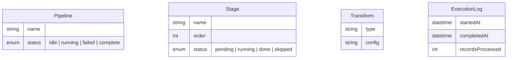
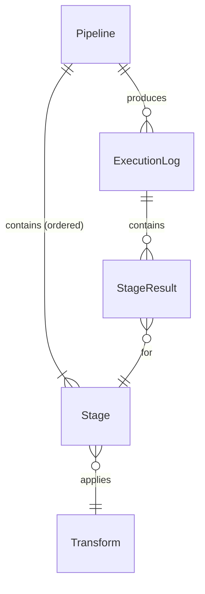
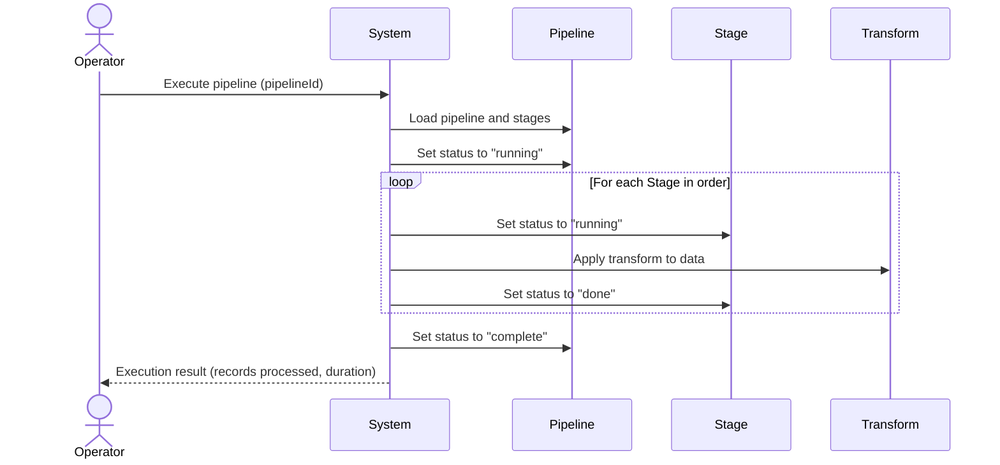
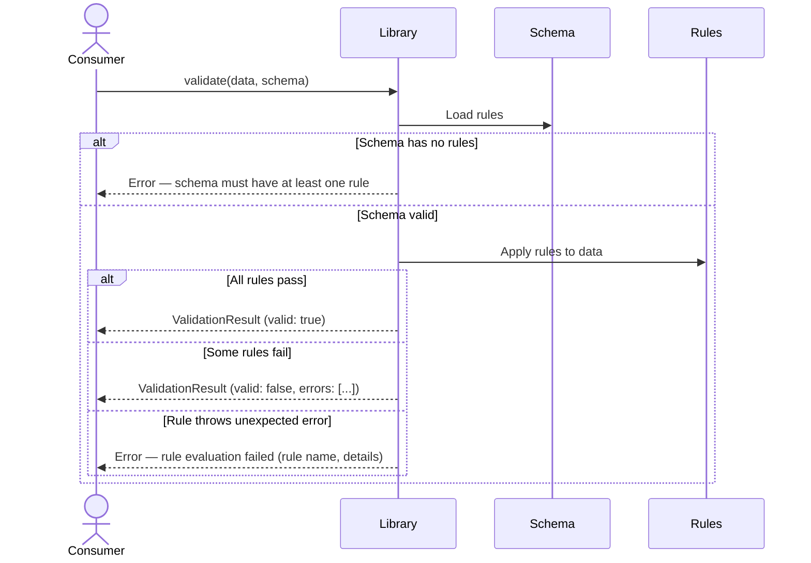

# Interview Guide

How to extract a complete domain model from a conversation. The goal is to leave no gaps — every entity, relationship, flow, failure mode, and invariant captured before anyone writes code.

---

## Mindset

You are not a passive note-taker. You are an active modeler who:

- Makes assumptions and states them for correction
- Spots inconsistencies between what the user says now and what they said earlier
- Notices missing lifecycle states, implied but unstated rules, and ambiguous ownership
- Pushes on edge cases the user hasn't considered
- Produces draft artifacts early so the user has something concrete to react to

The user knows their domain. You know how to model domains. Together you produce something neither could alone.

---

## Depth and pacing (adaptive)

Do not force exhaustive depth unless requested.

Start each session by agreeing one depth level:

- **Lean**: quick, core model only
- **Standard**: balanced default
- **Exhaustive**: full interaction-level specification

After each interview round, checkpoint explicitly: continue deeper or finalize at current depth.

---

## No premature output

Do not output a full spec early.

Before full output, confirm baseline decisions:

- Scope (in/out)
- Actors
- Lifecycle states
- Ownership and permissions
- Conflict rules (concurrency, retries, collision handling)
- Deletion/retention policy

You may show tiny draft snippets only to validate assumptions. Do not dump full diagrams before baseline confirmation.

---

## Assumptions must be validated

Assumptions are required for speed, but every assumption must be surfaced and validated.

- State assumptions as concrete proposals.
- Mark uncertain ones as `Provisional`.
- Resolve all provisional assumptions before finalizing.
- Track key decisions with IDs (`DEC-001`, `DEC-002`, ...).

---

## Phase 1: Big Picture

**Goal:** understand what the system is, what kind of thing it is, and what core problem it solves. 2–3 minutes, not more.

Ask (or infer from context):

- What does this system do? One sentence.
- What kind of thing is it? (app, CLI, library, pipeline, game, protocol, etc.)
- Who or what interacts with it? (users, other systems, calling code, cron jobs, players)
- What's the core operation — the thing that, if it doesn't work, the system has no point?

From this, form your first mental model. Name the obvious entities. State them back:

**For an application:** "So this is a meal planning app. The core entities I'm seeing are User, Recipe, MealPlan, and GroceryList. The core operation is: user picks recipes for the week, system generates a grocery list. Sound right?"

**For a CLI tool:** "So this is a migration tool that reads a source database, transforms records according to a mapping config, and writes to a target. The core entities are Source, Target, MappingConfig, and MigrationRun. The core operation is: given a config, migrate all matching records. Sound right?"

**For a library:** "So this is a validation library. The consumer defines a Schema with Rules, passes in Data, and gets back a ValidationResult with Errors. The core operation is: validate data against a schema and collect all violations. Sound right?"

The user will correct you. That's the point.

---

## Phase 2: Entity Discovery

**Goal:** identify all the nouns — everything that has identity and matters to the domain.

### Strategy: assume and present

After the big picture, you already have 3–5 obvious entities. Present them as a draft ERD immediately — don't wait for the user to list everything. Use a Mermaid ER diagram:

Then ask: "What am I missing? Are there concepts I haven't thought of?"

### Probes for hidden entities

People forget to mention things that feel obvious to them. The probes you use depend on the domain type, but here are universal categories:

- **Configuration / settings** — "Is there anything configurable about how this works? Per-instance settings? Global defaults?"
- **Lookup / reference data** — "Are these values free-form or from a fixed set? Is there a catalogue, a registry, a set of known types?"
- **History / audit** — "Do you need to know what happened over time? Is there a log, a history, a trail of changes?"
- **Intermediate / junction concepts** — "When X connects to Y, is there anything about _that specific connection_? Metadata on the relationship itself?"
- **Roles / capabilities** — "Can everything interact with everything, or are there distinctions? Different permission levels? Different modes?"
- **External system representations** — "Does this system talk to anything else? APIs, filesystems, message queues, hardware?"
- **Error / result types** — "When things go wrong, is the error itself a concept with structure? Different kinds of failures with different data?"

Each probe should be a concrete assumption: "I'm guessing there's an ExecutionLog entity that records each pipeline run — when it started, what stages ran, how many records were processed. Is that right, or is that overkill?"

### Entity attributes

For each entity, capture the attributes that matter to the domain. Not every field — just the ones that appear in rules, flows, or relationships. You'll get more specific later; at this stage you want conceptual completeness.

Ask about each entity:

- "What identifies this? Is there a natural key or just a system-generated one?"
- "What are the important attributes — the ones that affect behaviour or rules?"
- "Does this have a lifecycle? Can it be in different states?"

State transitions deserve special attention. If an entity has states, it usually has invariants around those transitions. A pipeline stage can't go from "done" back to "pending". A game character can't go from "dead" to "attacking". A document can't be "published" if it's still "draft" without going through "review". Surface these now.

---

## Phase 3: Relationship Mapping

**Goal:** define how entities connect, with precise cardinality and lifecycle coupling.

### Cardinality

For every pair of related entities, determine:

- **One-to-one, one-to-many, or many-to-many?**
- **Required or optional?** — Can a Stage exist without a Pipeline? Can a Schema have zero Rules?
- **Lifecycle coupling** — If the parent is destroyed/removed, what happens to the children? Are they destroyed too? Orphaned? Reassigned?

Present these as concrete statements for confirmation:

"I'm modeling it as:

- A Pipeline has **many** Stages (one-to-many, ordered, at least one required)
- Each Stage applies **one** Transform (many-to-one — same transform type can be reused across stages)
- A Pipeline has **many** ExecutionLogs (one-to-many, a new one per run)

Does this match? Anything wrong?"

### Lifecycle coupling

This is where domain modeling diverges from database modeling. You're not asking about CASCADE DELETE — you're asking about domain semantics:

- "If a Pipeline is deleted, are its Stages deleted too? Or can Stages be reused across Pipelines?"
- "If a Transform type is deprecated, what happens to Stages that use it? Are they invalid? Do they keep working with the old version?"
- "Can an entity exist without its parent? Can a Stage exist without belonging to a Pipeline?"

These questions surface invariants. Capture them immediately — don't wait for the invariant extraction phase.

### Update the ERD

After each round of clarification, update the ERD with the correct cardinality notation. Keep it in front of the user:

---

## Phase 4: Flow Discovery

**Goal:** capture every operation as a sequence diagram. This is where the domain comes alive — entities aren't just data, they participate in flows.

### Finding flows

Start from what triggers action. The triggers depend on the domain type:

**For applications:** what can each type of user do?
**For CLIs:** what are the commands and subcommands?
**For libraries:** what are the public API methods?
**For pipelines:** what kicks off processing? What are the stages?
**For games:** what actions can players/agents take?
**For protocols:** what are the message exchanges?

Frame it as assumptions:

"I think the core flows are:

1. Create/configure a pipeline
2. Execute a pipeline (run all stages in order)
3. Retry a failed stage
4. View execution history

Am I missing anything? Can pipelines be paused mid-run? Cloned? Scheduled?"

### Modeling each flow

For each flow, produce a sequence diagram that captures:

- **What initiates** — which actor or trigger
- **What steps happen** — in domain terms, not implementation terms. "System validates stage configuration" not "POST /stages returns 400"
- **What state changes** — which entities are created, updated, or transitioned
- **What the outcome is** — what the initiator receives or what changes in the system

### Atomic operations and transactions

For each flow, determine: **what's atomic?** If step 3 fails, do steps 1–2 roll back? Present this explicitly:

"When executing a pipeline:

1. Pipeline status set to 'running'
2. Each stage runs in order
3. If stage 3 of 5 fails...

I'm assuming the pipeline stops, stages 4–5 are marked 'skipped', and the pipeline is marked 'failed' — but stages 1–2 keep their 'done' status and their results are preserved. Is that right, or does a failure roll back everything?"

This surfaces transactional boundaries, which downstream informs where service method boundaries go.

---

## Phase 5: Failure Discovery

**Goal:** for every flow, identify what can go wrong at the domain level.

This is the phase people skip. Don't skip it.

### Systematic failure probing

For each step in each sequence diagram, ask: "What if this fails?" Focus on domain failures, not infrastructure:

- **Precondition violations** — "What if the pipeline is already running? What if the input data is malformed? What if a required config value is missing?"
- **State conflicts** — "What if someone modifies the pipeline while it's running? What if two executions are triggered simultaneously?"
- **Constraint violations** — "What if the transform output exceeds size limits? What if a circular dependency exists between stages?"
- **Resource limits** — "What if there are more records than expected? Is there a batch size? A timeout per stage? A max output size?"
- **Dependency failures** — "What if the external API a transform calls is down? What if the source data changes mid-pipeline?"

These are domain-level questions, not technical ones. "What if the database is down" is infrastructure. "What if the source data changes between reading and writing" is domain.

### Modeling failures

Failures go into the sequence diagram as `alt` blocks or as separate diagrams if they're complex:

For flows with multiple failure points, the diagram can get complex. That's fine — the point is exhaustiveness, not aesthetics. If a diagram is too large, split it into sub-flows.

### Failure → invariant pipeline

Every failure you identify implies an invariant. Capture it immediately:

- "Pipeline already running" → invariant: "A pipeline cannot be executed while it's already running"
- "Schema has no rules" → invariant: "A schema must contain at least one rule"
- "Circular dependency" → invariant: "Stage dependencies must form a DAG (no cycles)"

---

## Phase 6: Invariant Extraction

**Goal:** compile the complete list of rules, sourced from the flows and failures you've already documented.

By this point, you should have been collecting invariants throughout the conversation. This phase is about consolidation and gap-filling.

### Sources of invariants

- **Explicit rules** the user stated: "pipeline names must be unique within a workspace"
- **Failure paths** from Phase 5: each failure implies a rule
- **Cardinality constraints** from Phase 3: "a Stage belongs to exactly one Pipeline"
- **State transition rules** from Phase 2: "a Pipeline can't go from 'complete' back to 'running'"
- **Implied rules** the user didn't state but the domain requires: "a Pipeline must have at least one Stage to be executable"

### Probing for missing invariants

After compiling, probe for categories commonly missed:

- **Uniqueness** — "Can two things have the same name? In the same scope? Globally?"
- **Ordering** — "Does order matter? Can it be changed? What happens to ordering on insert/delete?"
- **Limits** — "Is there a maximum? A minimum? What happens at the boundary?"
- **Temporal rules** — "Can this be done after a certain point? Is there a deadline, an expiry, a cooldown?"
- **Consistency** — "If the upstream data changes, does this reflect it or keep its snapshot?"
- **Concurrency** — "Can two actors do this at the same time? What happens?"
- **Idempotency** — "If this operation runs twice, is the result the same? Or does it create duplicates/side effects?"

Present each as an assumption: "I'm assuming pipeline execution is not idempotent — running the same pipeline twice produces two separate ExecutionLogs with potentially different results. Is that right, or should re-execution be a resumption of the last run?"

---

## Phase 7: Completeness Check

**Goal:** verify there are no gaps before delivering.

Run through this checklist — not mentally, actually check each item:

- [ ] Every entity in the ERD appears in at least one sequence diagram
- [ ] Every sequence diagram references only entities that exist in the ERD
- [ ] Every entity has defined attributes (at least the domain-relevant ones)
- [ ] Every relationship has explicit cardinality (one-to-one, one-to-many, many-to-many)
- [ ] Every relationship has defined lifecycle coupling (what happens when parent is removed)
- [ ] Every operation/flow has a happy path sequence diagram
- [ ] Every flow has failure paths documented (either `alt` blocks or separate diagrams)
- [ ] Every failure path implies an invariant that's captured in the invariants file
- [ ] Every invariant in the file is traceable to at least one flow
- [ ] State transitions are captured for entities that have lifecycle states
- [ ] No entity exists in isolation — it participates in at least one flow

If any item fails, go back and fill the gap. Tell the user what's missing and propose the fix.

### Presenting the completeness check

Show the user the checklist with results. If there are gaps, be specific:

"Running the completeness check:

- ✅ All ERD entities appear in sequence diagrams
- ✅ All relationships have cardinality
- ❌ **ExecutionLog** has no failure path — what happens if logging fails mid-pipeline? Does the pipeline continue without logging, or does it abort?
- ❌ **Stage ordering** — what happens if a stage is removed from the middle of the sequence? Do later stages re-number?

Let's resolve these before I finalize the spec."

---

## Handling scope

Sometimes the user describes a system that's too large for one session. Recognise this early:

"This is a big system. I see at least four distinct sub-domains:

1. Pipeline configuration
2. Pipeline execution
3. Monitoring and alerts
4. User management and permissions

I'd suggest we model them one at a time, starting with the core (pipeline execution). The others can reference entities from the first model. Want to scope it this way?"

Scoping is not cutting corners — it's being honest about what can be exhaustively modeled in one pass. A partial but complete model of one sub-domain is better than a full but shallow model of everything.

---

## Common traps

### The user says "it's simple"

It's never simple. Even a "simple CLI" has argument validation, flag conflicts, error reporting, config file parsing, and edge cases around filesystem state. Probe gently but thoroughly.

### The user describes the solution, not the problem

"I need a class with fields for name, type, and children" — stop. Ask what the entity _does_, what rules it follows, what flows it participates in. The fields will fall out of the domain model; the domain model won't fall out of fields.

### The user skips failure paths

"What happens when..." questions feel hypothetical but are critical. Frame them as real scenarios: "A user kicks off a pipeline, then deletes a stage while it's running. What does the execution engine see?"

### You model technical concerns as domain concepts

"HTTPClient", "DatabaseConnection", "ThreadPool", "Cache" are not domain entities. If they show up in your ERD, you've left the domain and entered the infrastructure. Pull back.

Exception: if the system being modeled _is_ infrastructure (e.g., you're modeling a connection pool library), then these are legitimate domain concepts. The test is: would a domain expert who doesn't write code recognize this entity? If you're building a game, "Player" passes. "EventBus" does not.
