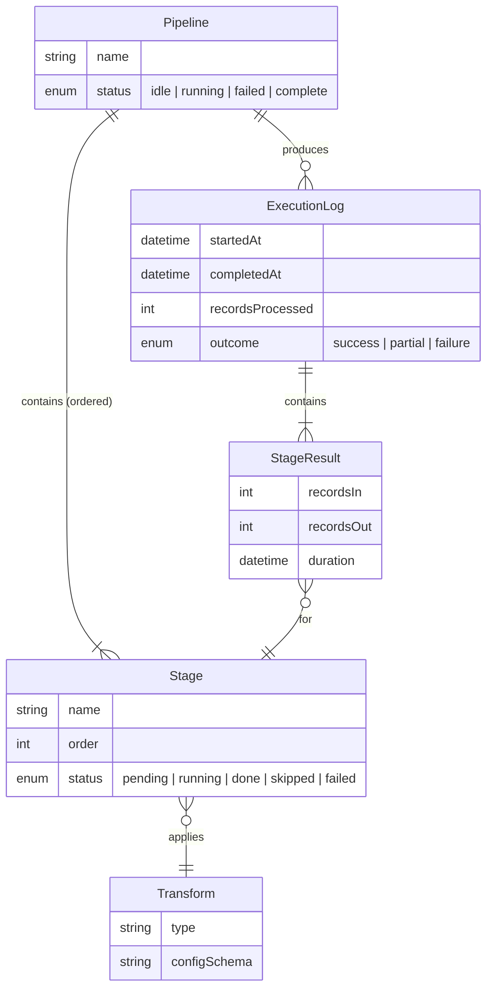
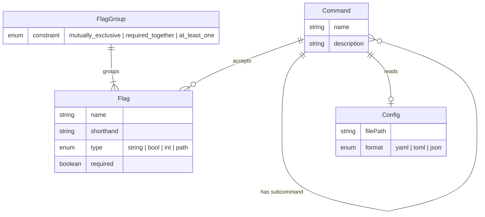
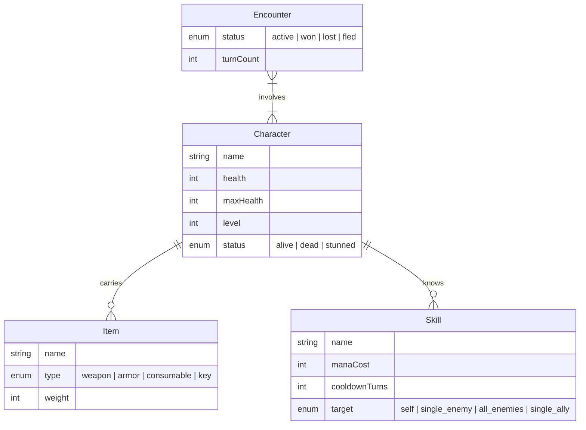
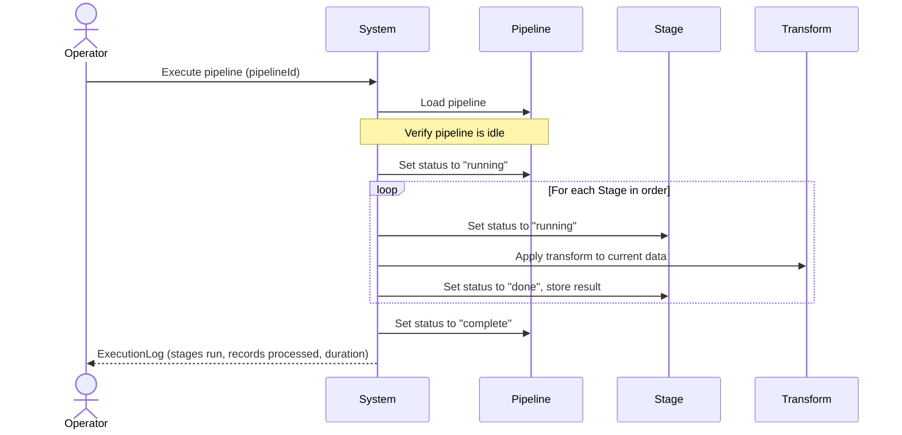
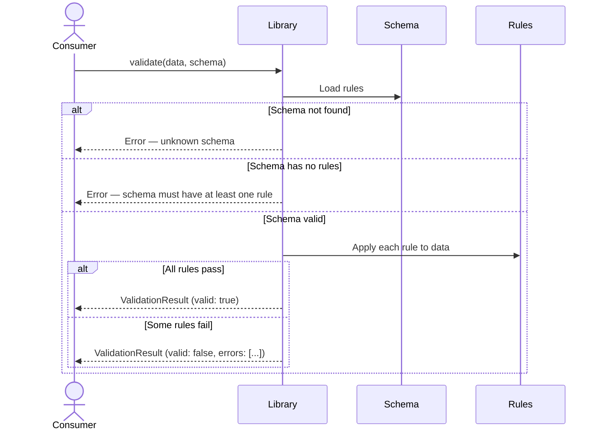
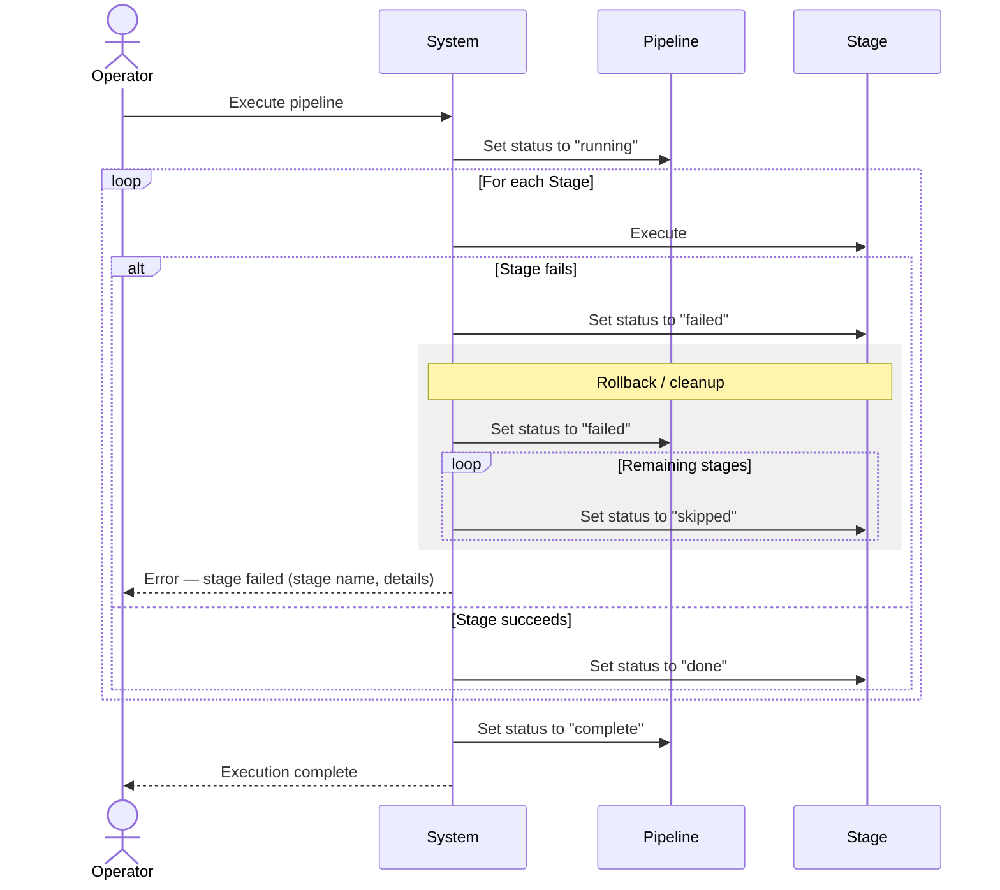
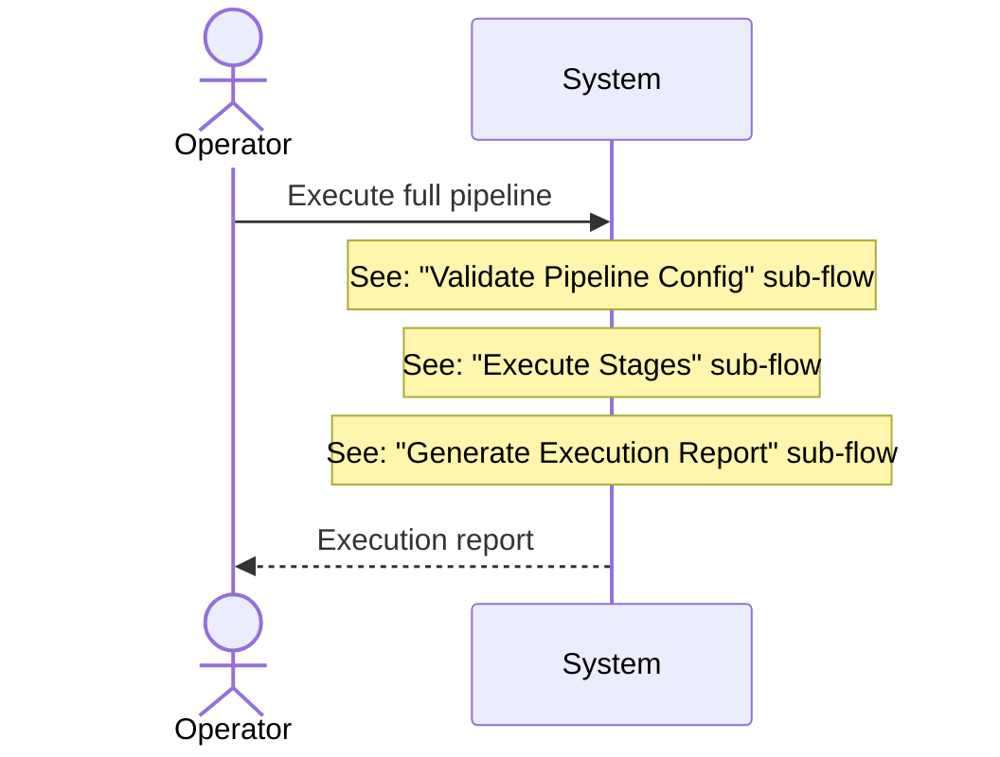

# Output Format

Mermaid conventions, invariant file format, and the structure of the final deliverable.

---

## Deliverable structure

The final output is a single Markdown file (or set of files for very large domains) containing:

```markdown
# Domain Specification: [System Name]

## Depth Profile

[Lean | Standard | Exhaustive]

## Decision Log

- DEC-001: ...
- DEC-002: ...

## Overview

[2–3 sentences: what this system does, what kind of thing it is, core operation]

## Entity Relationship Diagram

[Single Mermaid ERD covering all entities]

## Flows

### [Flow Name]

#### Happy Path

[Mermaid sequence diagram]

#### Failure Paths

[Mermaid sequence diagram with alt blocks, or separate diagrams]

### [Next Flow]

...

## Invariants

[Numbered list of rules]

## Interaction Matrix (Exhaustive only)

[Interaction IDs, triggers, preconditions, postconditions, typed errors]

## Traceability (Exhaustive only)

[Interaction -> Diagram -> Invariant links]

## Completeness Checklist

[Results of the Phase 7 check]
```

---

## Output timing rule

Do not produce a full deliverable until the interview baseline is confirmed (scope, actors, lifecycles, ownership, conflict rules, deletion/retention). During interview, share only small draft artifacts for validation.

---

## Conceptual ERD conventions

The ERD is purely conceptual. It captures what exists and how things relate — not how they're stored or implemented.

### What belongs in the ERD

- Entity names in **domain language** — `MealSlot`, not `meal_plan_recipes` (that's a join table). `ASTNode`, not `node_table`. `GameAction`, not `action_queue_item`.
- Attributes that affect behaviour — `status`, `type`, `mode`, `level`. Not implementation fields like `id`, `created_at`, `updated_at` (those are assumed to exist where relevant)
- Relationships with cardinality and a verb describing the relationship
- Enum-like states for entities with lifecycles

### What does NOT belong

- SQL types (`varchar`, `integer`, `timestamp`)
- Primary keys, foreign keys, indexes
- Nullable markers (express optionality through cardinality instead)
- Implementation-level entities (`AuditLog`, `Cache`, `EventBus`) unless they're genuinely part of the domain
- Language-specific types (`Vec<T>`, `Optional<String>`) — use conceptual types (`string`, `int`, `boolean`, `enum`, `list`)

### Mermaid ER syntax

Example for a **data pipeline** domain:



Example for a **CLI tool** domain:



Example for a **game system** domain:



### Cardinality notation

| Notation     | Meaning                                     |
| ------------ | ------------------------------------------- |
| `\|\|--\|\|` | Exactly one to exactly one                  |
| `\|\|--o{`   | One to zero or many                         |
| `\|\|--\|{`  | One to one or many (at least one)           |
| `}o--\|\|`   | Zero or many to exactly one                 |
| `}o--o{`     | Zero or many to zero or many (many-to-many) |

Always include the relationship verb: `"contains"`, `"applies"`, `"carries"`, `"produces"`. The verb clarifies directionality and ownership.

### Enums and states

If an entity has a lifecycle, include the states as an enum attribute. These will drive invariants around state transitions.

```
    Pipeline {
        enum status "idle | running | failed | complete"
    }
    Task {
        enum status "queued | running | done | cancelled"
    }
    Document {
        enum status "draft | review | published | archived"
    }
```

---

## Sequence diagram conventions

### Happy path structure

Every happy path diagram follows this pattern:

1. **Initiator acts** — the actor, trigger, or calling code that starts the flow
2. **System validates** — precondition checks, input validation, state checks
3. **System performs** — the domain operations (create, update, transition, compute)
4. **System responds** — what the initiator receives or what changes



### Failure path structure

Use `alt` blocks for failures that happen at a specific point in the flow. If a flow has multiple independent failure points, show them all:



### Naming participants

Participants are **domain concepts**, not implementation components:

- Good: `Pipeline`, `Stage`, `Transform`, `Character`, `Inventory`, `Schema`
- Also good for actors: `Operator`, `Player`, `Consumer`, `Scheduler`, `UpstreamSystem`
- Bad: `Frontend`, `API`, `Database`, `PipelineService`, `StageController`

The sequence diagram describes what happens in the domain, not how the code is structured. Code structure comes later in the architecture skill.

Exception: when modeling integrations with external systems, name the external system: `PaymentProvider`, `SourceDatabase`, `RemoteAPI`. These are domain-relevant because they represent boundaries the system interacts with.

### Transactions and atomicity

When a flow involves multiple state changes that must succeed or fail together, mark the transaction boundary:



The `rect` block visually groups atomic operations or rollback sequences. The failure paths show cleanup behaviour explicitly. This captures something that an ERD cannot — the transactional relationship between entities.

### Long flows

If a sequence diagram has more than ~15 interactions, split it into sub-flows. Reference sub-flows by name:



Then create separate diagrams for each sub-flow. This keeps diagrams readable while maintaining exhaustiveness.

---

## Invariants file format

Invariants are written in domain language. They are numbered, grouped by entity or concern, and each states a rule that must always be true.

### Example for a data pipeline:

```markdown
## Invariants

### Pipeline

1. A pipeline must have a non-empty, unique name within its workspace
2. A pipeline must have at least one stage to be executable
3. A pipeline cannot be executed while it is already running
4. A pipeline can only be deleted when it is in "idle" or "failed" status

### Stage

5. Stages within a pipeline have a unique, contiguous ordering starting from 1
6. A stage must reference a valid, non-deprecated transform
7. A stage's configuration must conform to its transform's config schema
8. Removing a stage re-numbers all subsequent stages

### Execution

9. An execution log is immutable once the pipeline completes or fails
10. Stage results are preserved even on pipeline failure (no rollback of completed stages)
11. A failed pipeline can be retried, which creates a new execution starting from the failed stage
12. Retry resumes from the failed stage, not from the beginning

### State Transitions

13. Pipeline: idle → running → complete (success path)
14. Pipeline: idle → running → failed (failure path)
15. Pipeline: failed → running (retry path)
16. Stage: pending → running → done | failed | skipped (no other transitions)
```

### Example for a game system:

```markdown
## Invariants

### Character

1. Health cannot exceed maxHealth
2. Health cannot go below zero (clamped to 0)
3. A character with 0 health has status "dead"
4. A dead character cannot perform actions
5. A stunned character can only perform the "wait" action

### Inventory

6. Total carried weight cannot exceed character's carry capacity
7. Equipping a weapon unequips any previously equipped weapon of the same slot
8. Key items cannot be dropped or sold

### Combat

9. Turn order is determined by character speed, recalculated each round
10. A skill cannot be used if the character's mana is below its mana cost
11. A skill on cooldown cannot be used until cooldownTurns reaches zero
12. An encounter ends when all characters on one side are dead or have fled
```

### Example for a CLI tool:

```markdown
## Invariants

### Commands

1. Every command must have a unique name within its parent scope
2. A command with subcommands cannot also accept positional arguments
3. Required flags must be provided or the command fails before execution

### Flags

4. Mutually exclusive flags cannot both be provided
5. "required_together" flags must all be present or all absent
6. A flag's value must be parseable as its declared type
7. Short flags must be a single character and unique within a command

### Config

8. CLI flags override config file values
9. Config file must be valid according to its declared format
10. Missing config file is not an error if all required values have defaults or are provided as flags
```

### Properties of good invariants

- **Domain language** — "Health cannot exceed maxHealth", not "CHECK health <= max_health"
- **Testable** — each invariant maps to one or more tests. If you can't write a test for it, it's too vague
- **Specific** — "Stages have a unique contiguous ordering starting from 1" not "stages have some ordering"
- **Sourced** — each invariant should trace back to a sequence diagram or a conversation point. If it doesn't, ask the user whether it's real
- **Numbered** — so they can be referenced by tests and validation reports downstream

### What's NOT an invariant

- Technical constraints: "The system must handle 1000 concurrent connections" — that's an SLA
- Performance requirements: "Transforms must complete in under 5 seconds" — that's a performance target
- UI behaviour: "The progress bar turns green on completion" — that's presentation
- Vague preferences: "The system should be easy to use" — not testable
- Infrastructure concerns: "The database should be replicated" — not domain

---

## Completeness checklist

Include this at the end of the specification, filled in:

```markdown
## Completeness Checklist

- [x] Every entity in the ERD appears in at least one sequence diagram
- [x] Every sequence diagram references only entities in the ERD
- [x] Every entity has domain-relevant attributes defined
- [x] Every relationship has explicit cardinality
- [x] Every relationship has defined lifecycle coupling semantics
- [x] Every operation/flow has a happy path diagram
- [x] Every flow has failure paths documented
- [x] Every failure path has a corresponding invariant
- [x] Every invariant traces to at least one flow
- [x] Entities with lifecycle states have transitions documented
- [x] State transition rules are captured as invariants
- [x] No entity exists without participating in at least one flow
- [x] Transactional boundaries are marked for multi-step operations
```

Any unchecked item is a gap. Resolve before delivering.

---

## Iteration

The specification is a living document during the interview. Update diagrams in place. Don't produce the full spec at the end — produce it incrementally:

1. After Phase 2: show the initial ERD
2. After each flow in Phase 4: show the sequence diagram
3. After Phase 5: show failure paths added to existing diagrams
4. After Phase 6: show the invariants file
5. After Phase 7: show the completeness checklist

Each time you show an artifact, the user confirms or corrects. By the time you reach Phase 7, the spec has already been reviewed in pieces. The final delivery is a consolidation, not a surprise.
