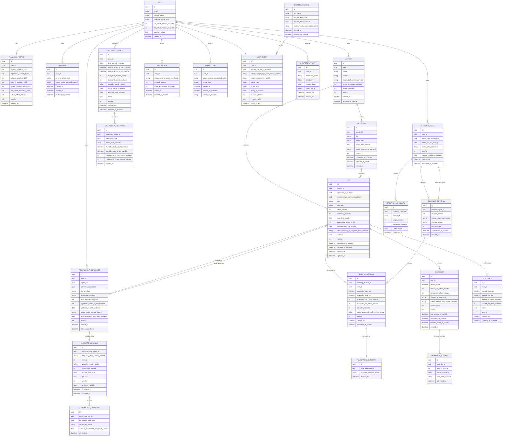

# Conceptual ERD

```mermaid
erDiagram
    USER ||--|| PLANNING_PROFILE : has
    USER ||--o{ SESSION : owns
    USER ||--o{ ASPECT : owns
    ASPECT ||--o{ MILESTONE : contains
    ASPECT ||--o{ TASK : contains
    MILESTONE ||--o{ TASK : organizes
    USER ||--o{ RECURRING_TASK_SERIES : owns
    RECURRING_TASK_SERIES ||--|| RECURRENCE_RULE : scheduled_by
    RECURRENCE_RULE ||--o{ RECURRENCE_EXCEPTION : excepts
    RECURRING_TASK_SERIES ||--o{ TASK : materializes_as
    TASK }o--o| RECURRING_TASK_SERIES : instance_of
    TASK ||--o{ TASK_ALLOCATION : scheduled_as
    TASK ||--o{ REMINDER : reminds
    TASK ||--o{ TASK_LOCK : lock_history
    USER ||--o{ AVAILABILITY_BLOCK : defines
    AVAILABILITY_BLOCK ||--o{ AVAILABILITY_EXCEPTION : excepts
    USER ||--o{ PLANNING_CYCLE : runs
    PLANNING_CYCLE ||--o{ PLANNING_REVISION : versions
    PLANNING_CYCLE ||--o| PLANNING_REVISION : current_revision
    PLANNING_REVISION ||--o{ TASK_ALLOCATION : contains
    TASK_ALLOCATION ||--o| ALLOCATION_OUTCOME : executed_as
    PLANNING_CYCLE ||--o{ ASPECT_CYCLE_HEALTH : scores
    USER ||--o{ IMPORT_JOB : imports
    USER ||--o{ EXPORT_JOB : exports
    USER ||--o{ AUDIT_EVENT : owns
    USER ||--o{ IDEMPOTENCY_KEY : dedupes
    SYSTEM_JOB_RUN ||--o{ AUDIT_EVENT : emits
    REMINDER ||--o{ REMINDER_ATTEMPT : delivery_attempts

    USER {
      uuid id
      string email
      string display_name
      string timezone_name_iana
      int utc_offset_minutes_snapshot
      int dst_offset_minutes_snapshot
      bool identity_verified
      datetime created_at
    }

    SESSION {
      uuid id
      uuid user_id
      string session_token_hash
      string status_active_revoked_expired
      datetime created_at
      datetime expires_at
      datetime revoked_at_nullable
    }

    PLANNING_PROFILE {
      uuid id
      uuid user_id
      int urgency_weight_0_100
      int importance_weight_0_100
      int balance_weight_0_100
      int effort_fit_weight_0_100
      int urgent_threshold_days_0_30
      int min_chunk_minutes_5_120
      int default_effort_minutes
      int version
      datetime updated_at
    }

    ASPECT {
      uuid id
      uuid user_id
      string name
      string purpose
      string status_draft_active_archived
      int target_percentage_nullable
      bool default_splittable
      int version
      datetime created_at
      datetime archived_at_nullable
    }

    MILESTONE {
      uuid id
      uuid aspect_id
      string title
      string description
      date target_date_nullable
      string status_open_done_archived
      int version
      datetime completed_at_nullable
      datetime archived_at_nullable
      datetime created_at
    }

    TASK {
      uuid id
      uuid aspect_id
      uuid milestone_id_nullable
      uuid recurring_task_series_id_nullable
      string title
      string description
      int effort_minutes
      int remaining_minutes
      date due_date_nullable
      int importance_score_0_100
      bool splittable_override_nullable
      string status_backlog_in_progress_done_archived
      bool overdue
      int version
      datetime completed_at_nullable
      datetime archived_at_nullable
      datetime created_at
      datetime updated_at
    }

    RECURRING_TASK_SERIES {
      uuid id
      uuid user_id
      uuid aspect_id
      uuid milestone_id_nullable
      string title_template
      string description_template
      int effort_minutes_template
      int importance_score_0_100_template
      bool splittable_override_nullable
      string status_active_paused_closed
      date next_occurrence_date_local_nullable
      int version
      datetime created_at
      datetime closed_at_nullable
    }

    RECURRENCE_RULE {
      uuid id
      uuid recurring_task_series_id
      string frequency_daily_weekly_monthly
      int interval
      string weekday_mask_nullable
      int month_day_nullable
      date anchor_date_local
      bool paused
      int version
      date ends_on_nullable
      datetime created_at
      datetime updated_at
    }

    RECURRENCE_EXCEPTION {
      uuid id
      uuid recurrence_rule_id
      date occurrence_date_local
      string action_skip_move
      date override_occurrence_date_local_nullable
      datetime created_at
    }

    AVAILABILITY_BLOCK {
      uuid id
      uuid user_id
      string kind_one_off_recurring
      datetime one_off_starts_at_utc_nullable
      datetime one_off_ends_at_utc_nullable
      int local_start_minute_nullable
      int local_end_minute_nullable
      string weekday_mask_nullable
      date starts_on_local_nullable
      date ends_on_local_nullable
      bool active
      int version
      datetime created_at
      datetime archived_at_nullable
    }

    AVAILABILITY_EXCEPTION {
      uuid id
      uuid availability_block_id
      date exception_date
      string action_skip_override
      datetime override_starts_at_utc_nullable
      datetime override_ends_at_utc_nullable
      int override_local_start_minute_nullable
      int override_local_end_minute_nullable
      datetime created_at
    }

    PLANNING_CYCLE {
      uuid id
      uuid user_id
      date week_start_iso_monday
      date week_end_iso_sunday
      string status_draft_confirmed
      int version
      uuid current_revision_id_nullable
      datetime created_at
      datetime confirmed_at_nullable
    }

    PLANNING_REVISION {
      uuid id
      uuid planning_cycle_id
      int revision_number
      string status_active_superseded
      string change_reason
      json diff_summary
      datetime superseded_at_nullable
      datetime created_at
    }

    TASK_ALLOCATION {
      uuid id
      uuid planning_revision_id
      uuid task_id
      datetime scheduled_start_utc
      datetime scheduled_end_utc
      int scheduled_utc_offset_minutes
      int scheduled_dst_offset_minutes
      int allocated_minutes
      string status_proposed_confirmed_cancelled
      int version
      datetime created_at
      datetime cancelled_at_nullable
    }

    TASK_LOCK {
      uuid id
      uuid task_id
      datetime locked_start_utc
      datetime locked_end_utc
      int locked_utc_offset_minutes
      int locked_dst_offset_minutes
      bool active
      int version
      datetime created_at
      datetime released_at_nullable
    }

    ALLOCATION_OUTCOME {
      uuid id
      uuid task_allocation_id
      string outcome_attended_missed
      datetime marked_at
    }

    ASPECT_CYCLE_HEALTH {
      uuid id
      uuid planning_cycle_id
      uuid aspect_id
      int target_minutes
      int completed_minutes
      float health_score
      datetime computed_at
    }

    REMINDER {
      uuid id
      uuid task_id
      datetime remind_at_utc
      int remind_utc_offset_minutes
      int remind_dst_offset_minutes
      string channel_in_app_email
      string status_pending_sent_failed_cancelled
      int snooze_count
      int version
      datetime last_attempt_at_nullable
      datetime next_retry_at_nullable
      datetime terminal_failed_at_nullable
      datetime created_at
    }

    REMINDER_ATTEMPT {
      uuid id
      uuid reminder_id
      int attempt_number
      string result_sent_failed
      string error_code_nullable
      datetime attempted_at
    }

    IMPORT_JOB {
      uuid id
      uuid user_id
      string status_running_succeeded_failed
      int created_entities
      int conflicted_entities_remapped
      datetime started_at
      datetime finished_at_nullable
    }

    EXPORT_JOB {
      uuid id
      uuid user_id
      string status_running_succeeded_failed
      string format_json
      datetime started_at
      datetime finished_at_nullable
      string artifact_ref_nullable
    }

    AUDIT_EVENT {
      uuid id
      uuid user_id
      uuid system_job_run_id_nullable
      string actor_principal_type_user_session_service
      string actor_principal_ref_nullable
      string event_type
      string entity_type
      uuid entity_id_nullable
      json redacted_before
      json redacted_after
      datetime occurred_at
    }

    IDEMPOTENCY_KEY {
      uuid id
      uuid user_id
      string command_name
      string key_hash
      string request_hash
      string response_ref
      datetime created_at
      datetime expires_at
    }

    SYSTEM_JOB_RUN {
      uuid id
      string job_name
      string job_run_key_hash
      string request_hash_nullable
      string status_running_succeeded_failed
      datetime started_at
      datetime finished_at_nullable
    }
```
