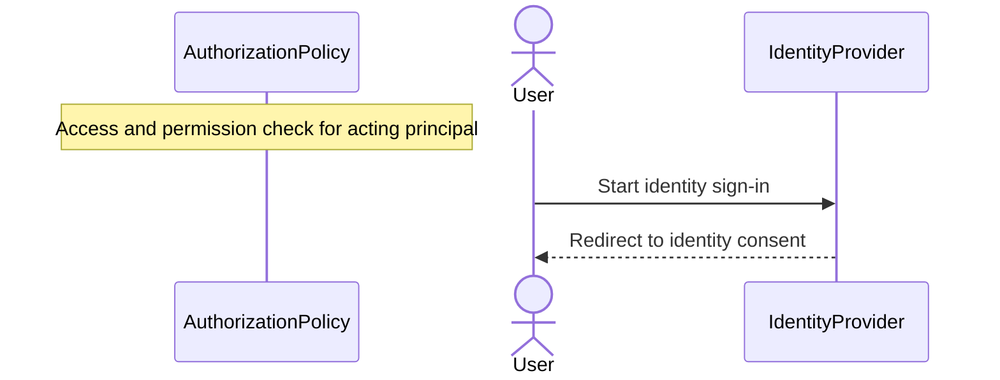
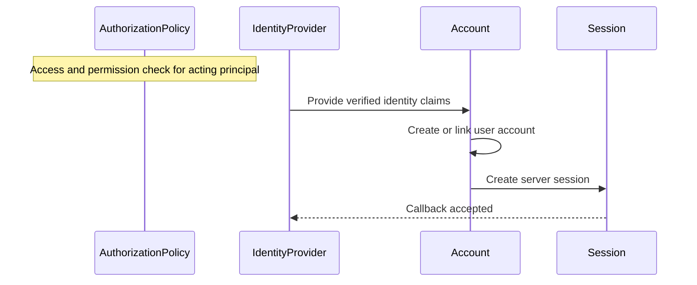
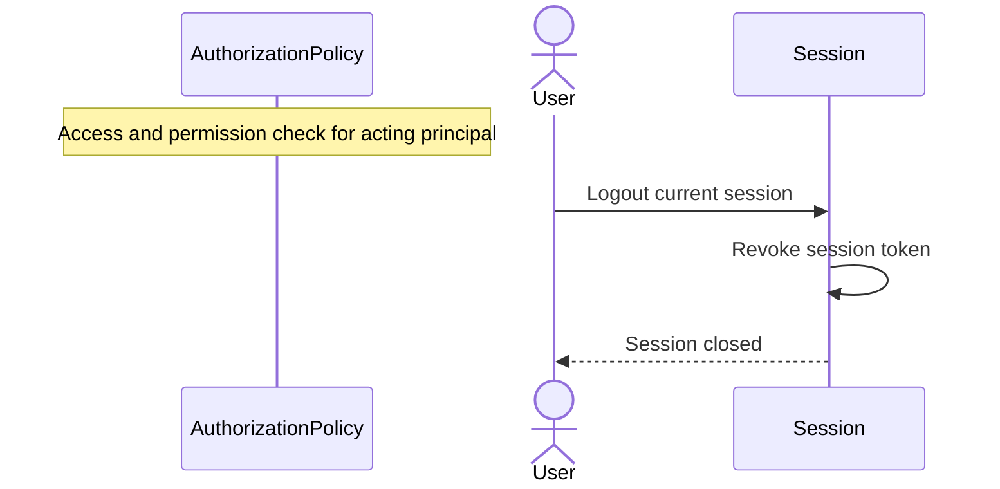
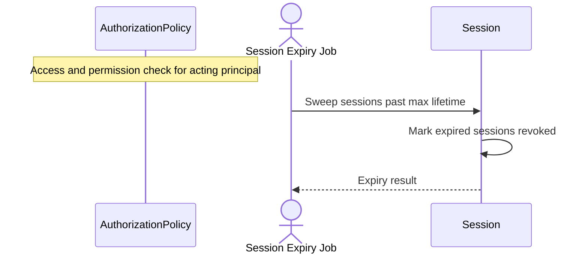
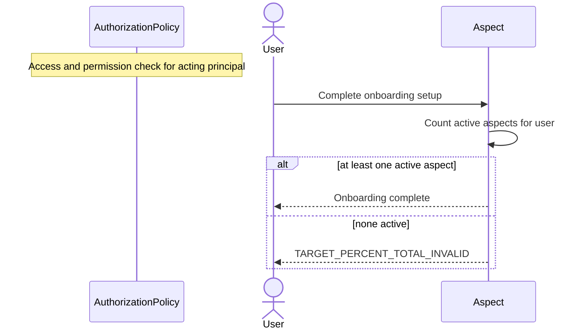
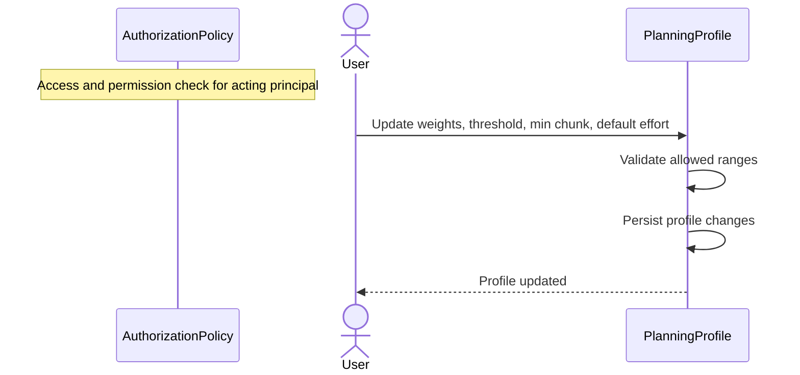

# Auth and Profile Sequences

## AUTH-01 Identity Sign-In Start

## AUTH-02 Identity Callback

## AUTH-03 Logout

## AUTH-04 Session Expiry

## AUTH-05 First-Run Wizard Completion

## PRF-01 Update Planning Profile

