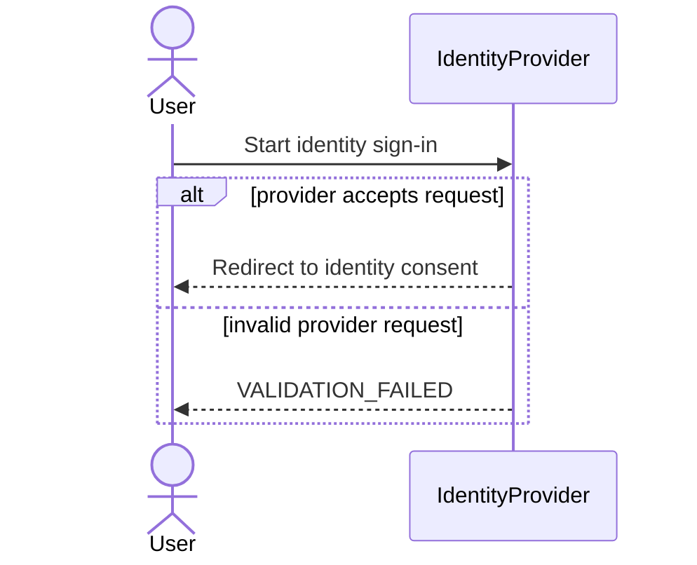
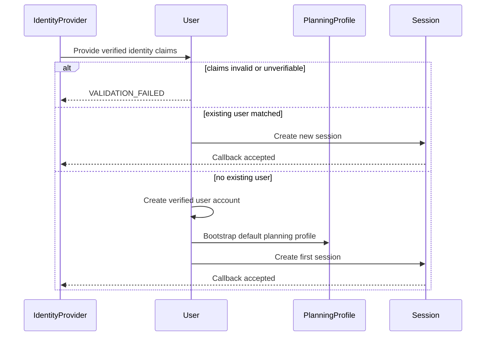
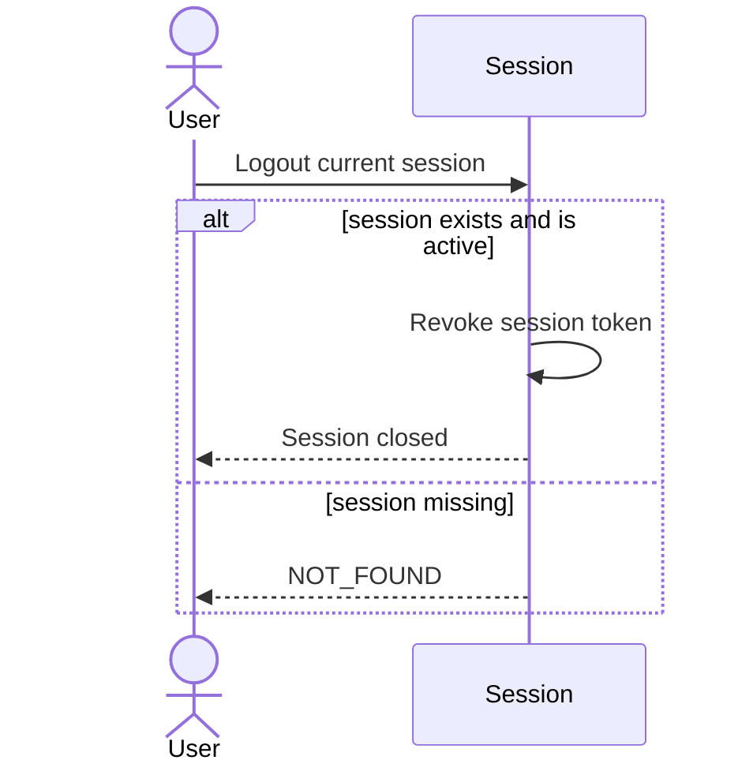
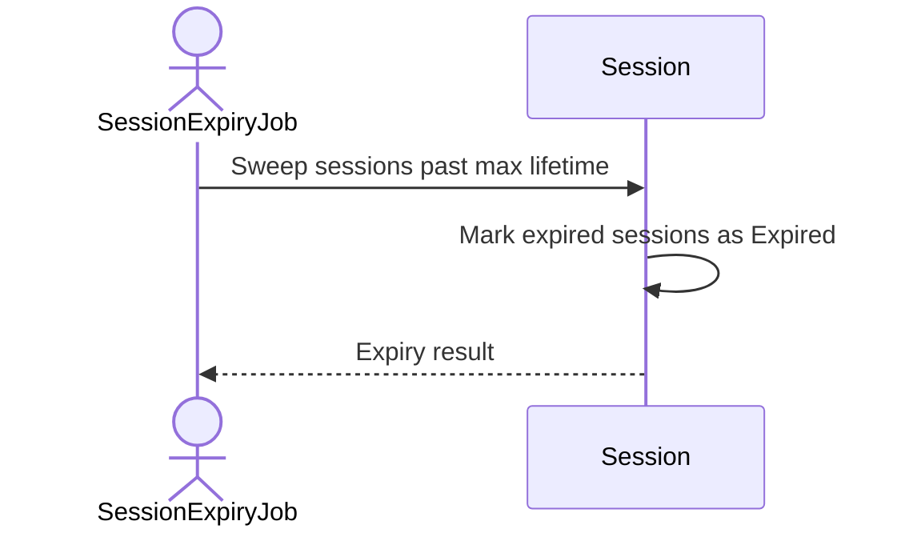
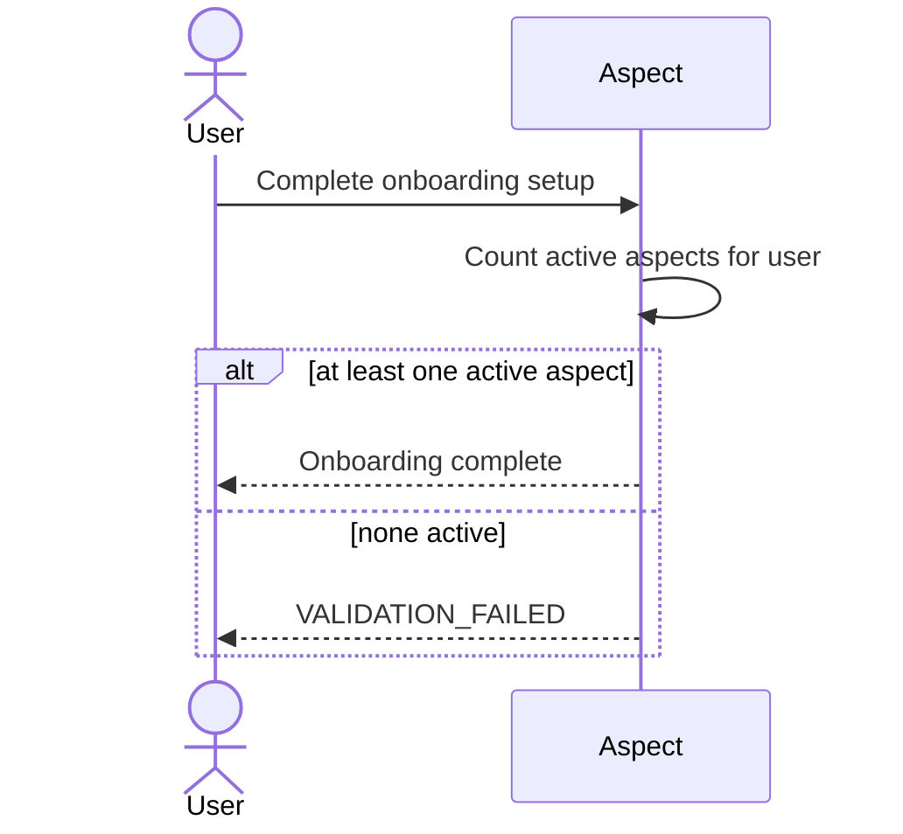
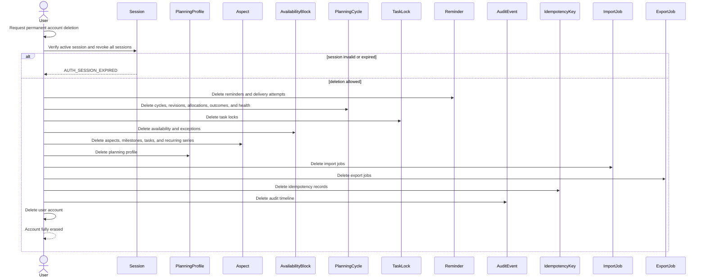
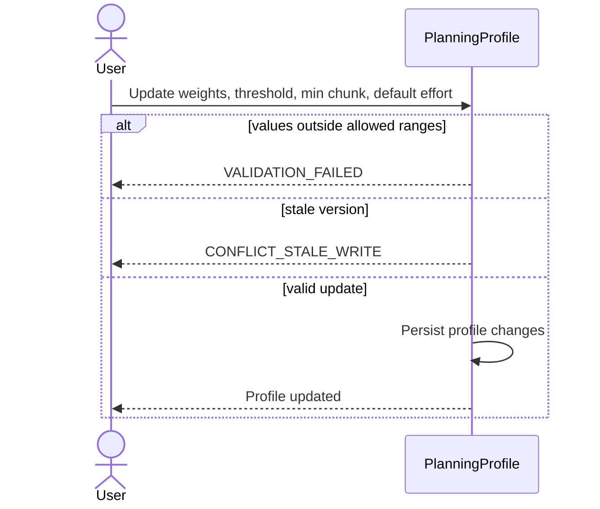

# Auth and Profile Sequences

All sequences assume principal validation before the first domain read or mutation except `AUTH-01` and `AUTH-02`, which occur before a user session exists.

## AUTH-01 Identity Sign-In Start

## AUTH-02 Identity Callback

## AUTH-03 Logout

## AUTH-04 Session Expiry

## AUTH-05 First-Run Wizard Completion

## AUTH-06 GDPR Account Deletion

## PRF-01 Update Planning Profile

