# Aspect and Milestone Sequences

All sequences assume principal validation before the first domain read or mutation.

## ASP-01 Create Draft Aspect

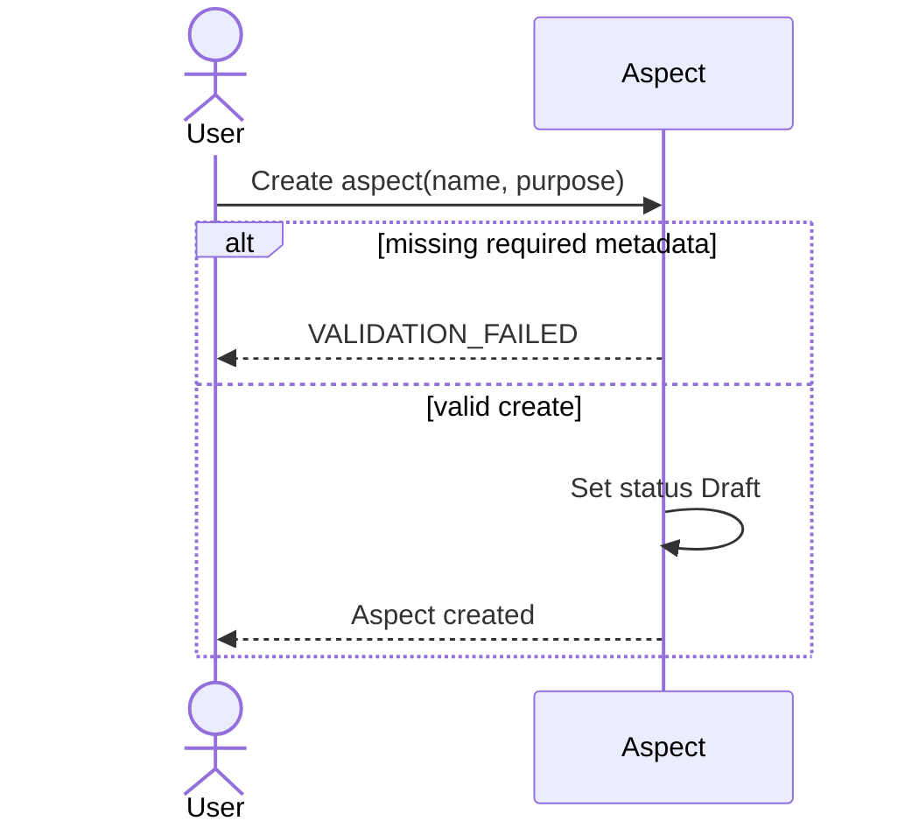

## ASP-02 Activate Aspect

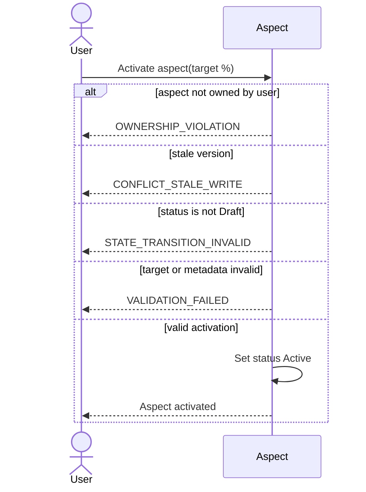

## ASP-03 Update Aspect

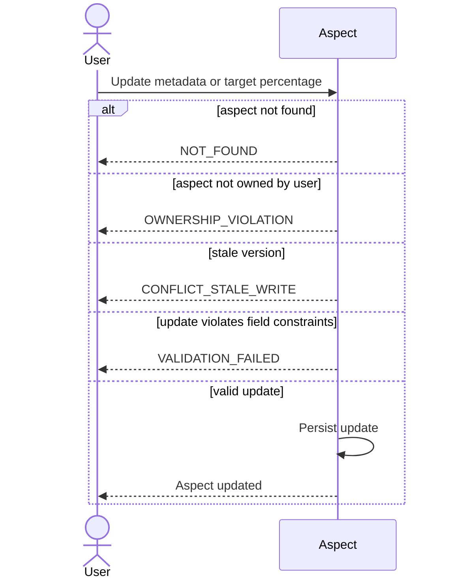

## ASP-04 Archive Aspect

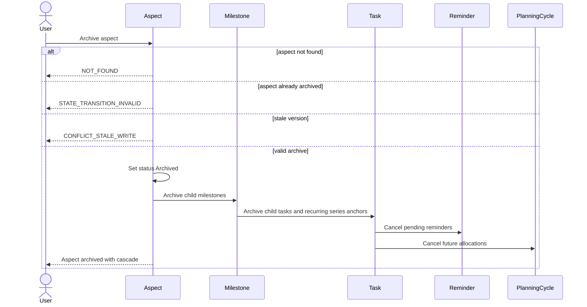

## ASP-05 Restore Aspect

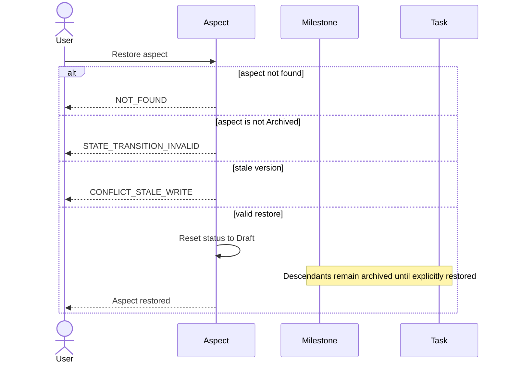

## ASP-06 Query Aspects

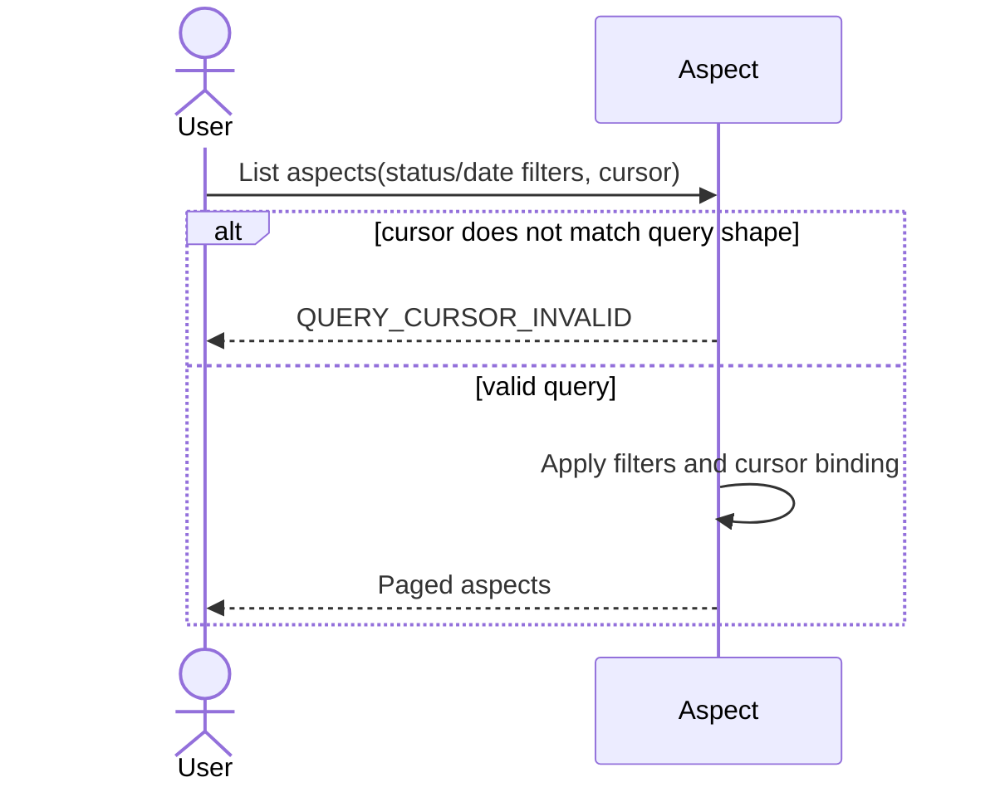

## MLS-01 Create Milestone

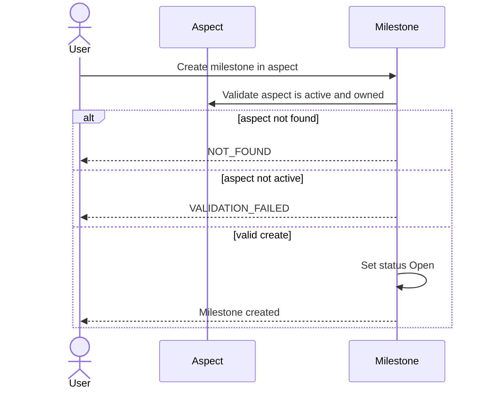

## MLS-02 Update Milestone

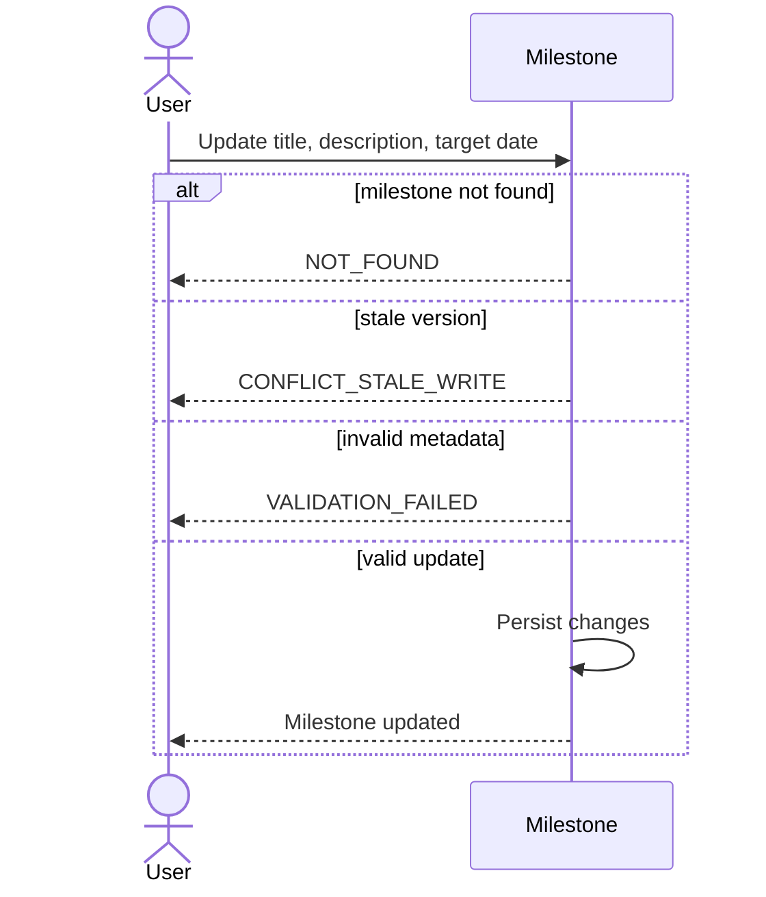

## MLS-03 Complete Milestone

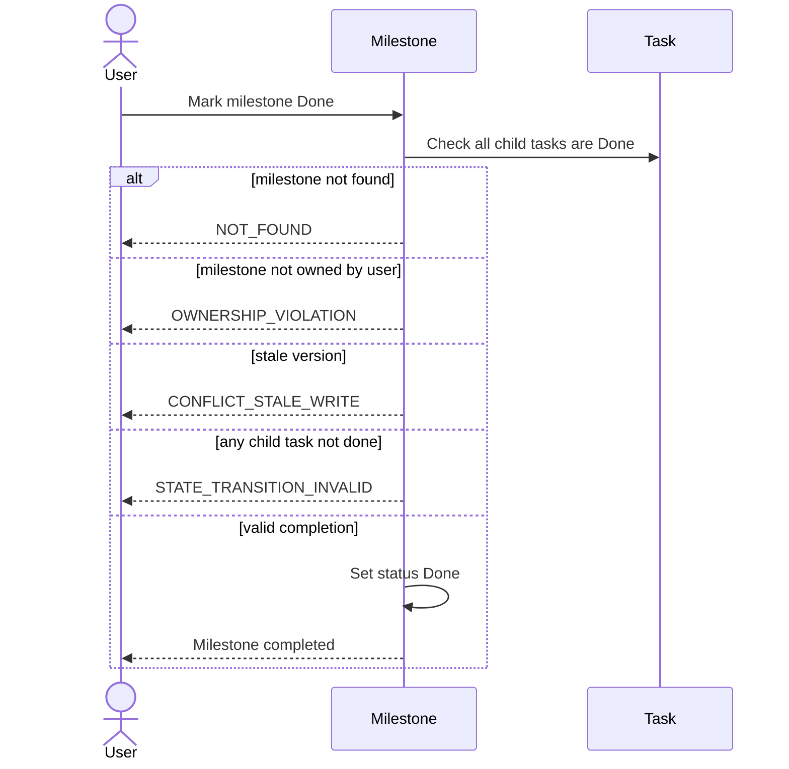

## MLS-04 Reopen Milestone

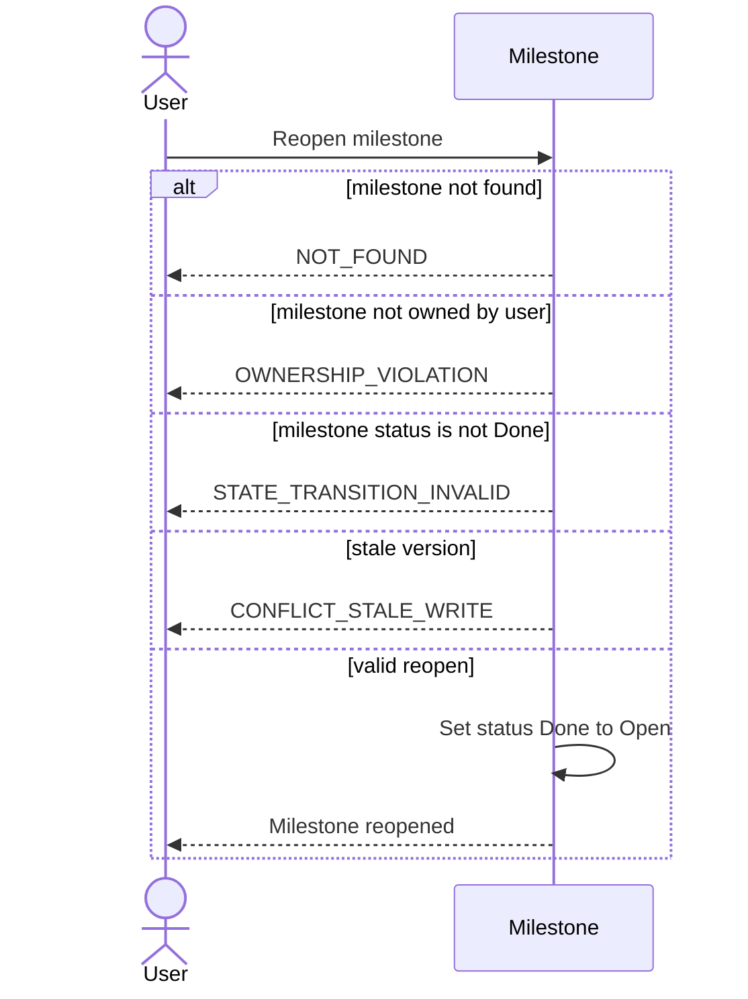

## MLS-05 Archive Milestone

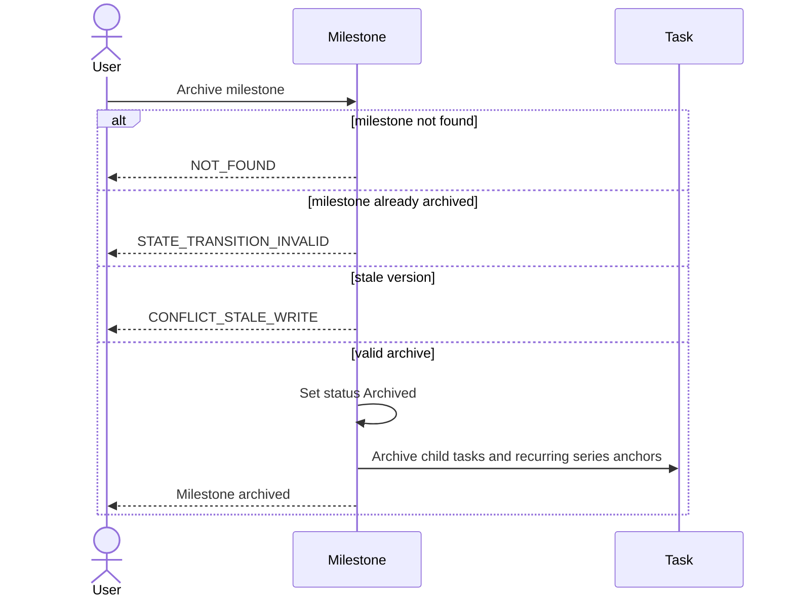

## MLS-06 Restore Milestone

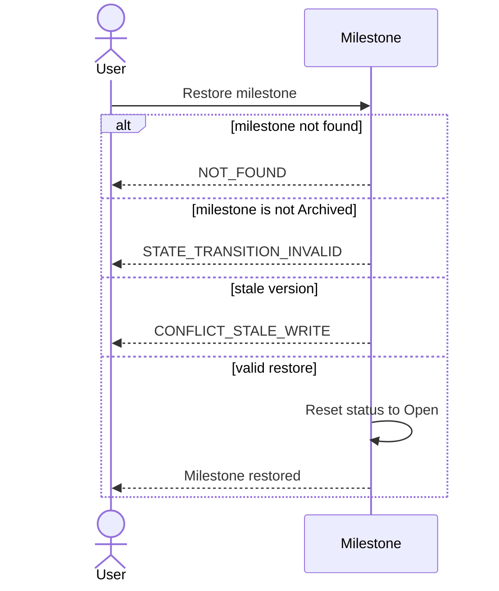

## MLS-07 Query Milestones

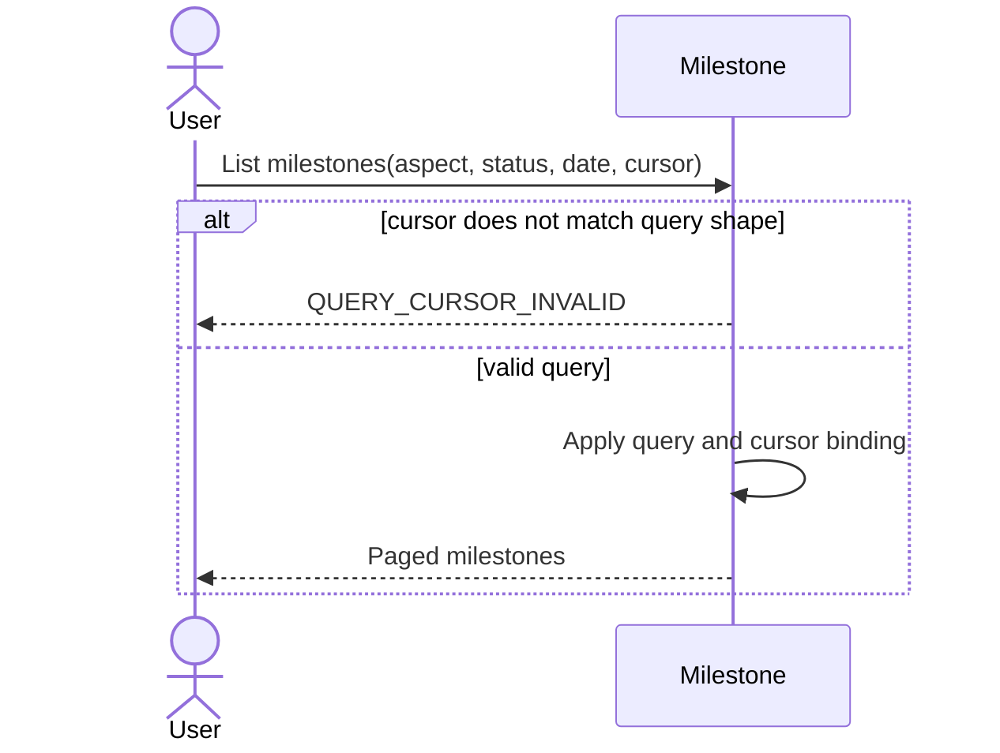
