# Task and Recurrence Sequences

All sequences assume principal validation before the first domain read or mutation.

## TSK-01 Create Task

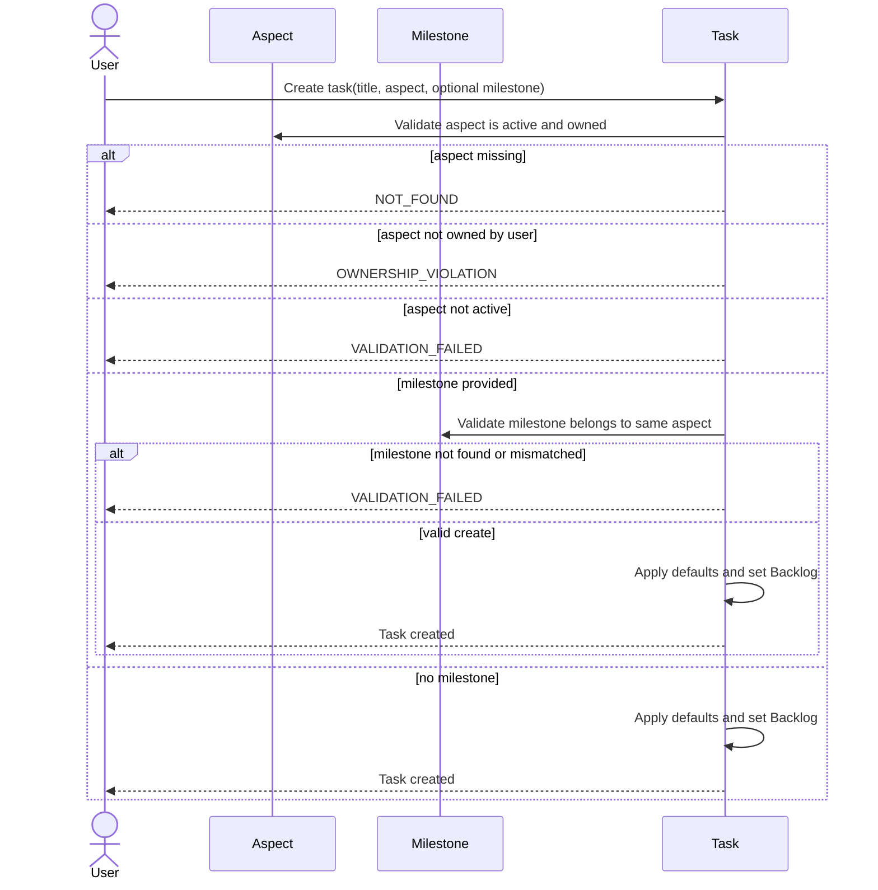
```mermaid
sequenceDiagram
    actor U as User
    participant A as Aspect
    participant M as Milestone
    participant T as Task
    U->>T: Create task(title, aspect, optional milestone)
    T->>A: Validate aspect is active and owned
    alt aspect missing
        T-->>U: NOT_FOUND
    else aspect not owned by user
        T-->>U: OWNERSHIP_VIOLATION
    else aspect not active
        T-->>U: VALIDATION_FAILED
    else milestone provided
        T->>M: Validate milestone belongs to same aspect
        alt milestone not found or mismatched
            T-->>U: VALIDATION_FAILED
        else valid create
            T->>T: Apply defaults and set Backlog
            T-->>U: Task created
        end
    else no milestone
        T->>T: Apply defaults and set Backlog
        T-->>U: Task created
    end
```

## TSK-02 Update Task

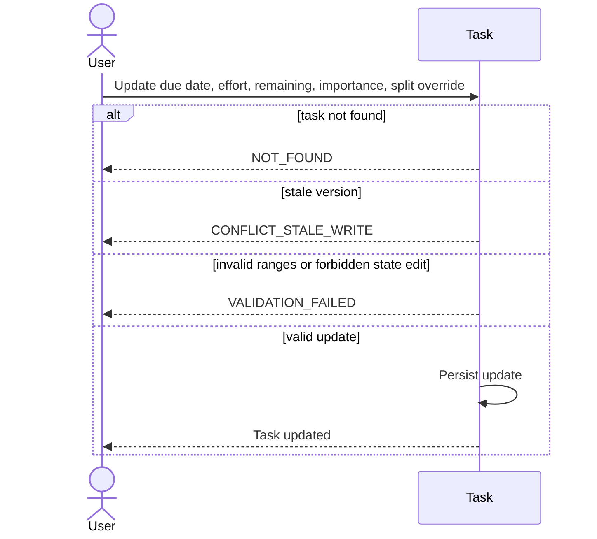
```mermaid
sequenceDiagram
    actor U as User
    participant T as Task
    U->>T: Update due date, effort, remaining, importance, split override
    alt task not found
        T-->>U: NOT_FOUND
    else stale version
        T-->>U: CONFLICT_STALE_WRITE
    else invalid ranges or forbidden state edit
        T-->>U: VALIDATION_FAILED
    else valid update
        T->>T: Persist update
        T-->>U: Task updated
    end
```

## TSK-03 Move Task Milestone

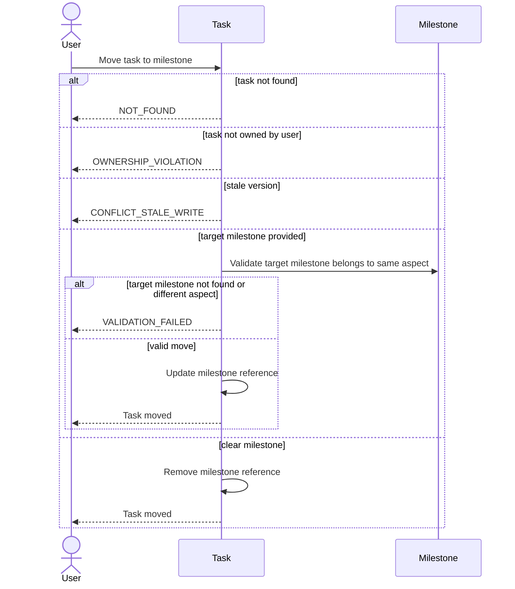
```mermaid
sequenceDiagram
    actor U as User
    participant T as Task
    participant M as Milestone
    U->>T: Move task to milestone
    alt task not found
        T-->>U: NOT_FOUND
    else task not owned by user
        T-->>U: OWNERSHIP_VIOLATION
    else stale version
        T-->>U: CONFLICT_STALE_WRITE
    else target milestone provided
        T->>M: Validate target milestone belongs to same aspect
        alt target milestone not found or different aspect
            T-->>U: VALIDATION_FAILED
        else valid move
            T->>T: Update milestone reference
            T-->>U: Task moved
        end
    else clear milestone
        T->>T: Remove milestone reference
        T-->>U: Task moved
    end
```

## TSK-04 Start Task

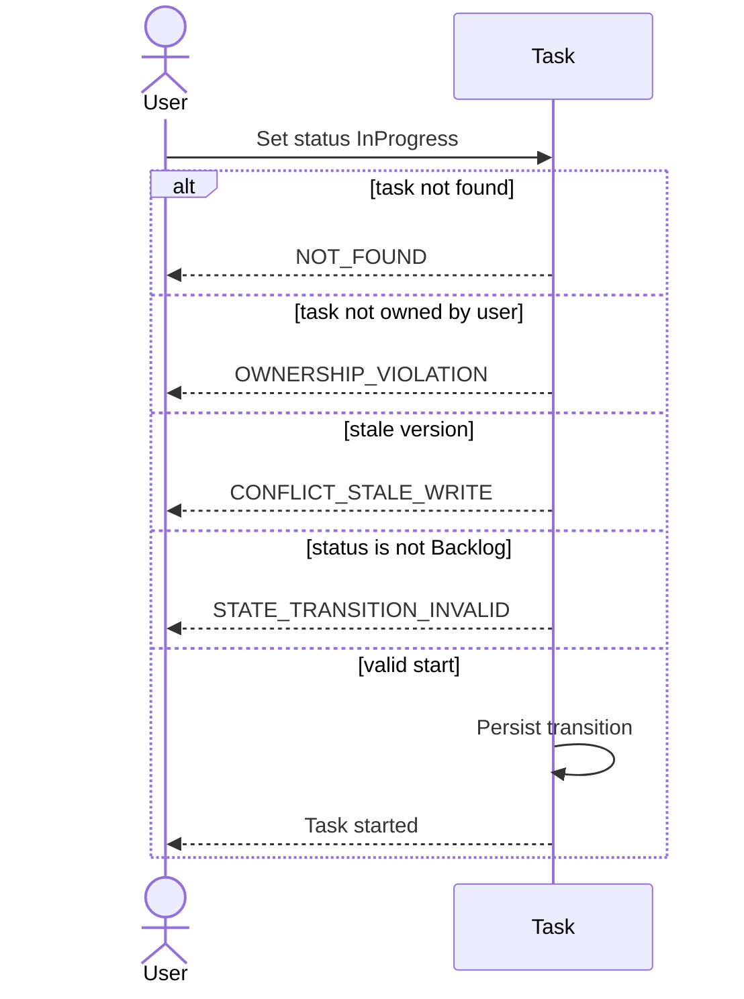
```mermaid
sequenceDiagram
    actor U as User
    participant T as Task
    U->>T: Set status InProgress
    alt task not found
        T-->>U: NOT_FOUND
    else task not owned by user
        T-->>U: OWNERSHIP_VIOLATION
    else stale version
        T-->>U: CONFLICT_STALE_WRITE
    else status is not Backlog
        T-->>U: STATE_TRANSITION_INVALID
    else valid start
        T->>T: Persist transition
        T-->>U: Task started
    end
```

## TSK-05 Complete Task

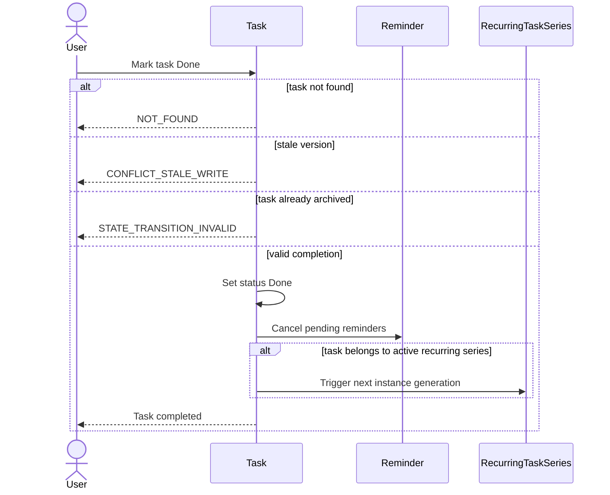
```mermaid
sequenceDiagram
    actor U as User
    participant T as Task
    participant R as Reminder
    participant S as RecurringTaskSeries
    U->>T: Mark task Done
    alt task not found
        T-->>U: NOT_FOUND
    else stale version
        T-->>U: CONFLICT_STALE_WRITE
    else task already archived
        T-->>U: STATE_TRANSITION_INVALID
    else valid completion
        T->>T: Set status Done
        T->>R: Cancel pending reminders
        alt task belongs to active recurring series
            T->>S: Trigger next instance generation
        end
        T-->>U: Task completed
    end
```

## TSK-06 Reopen Task

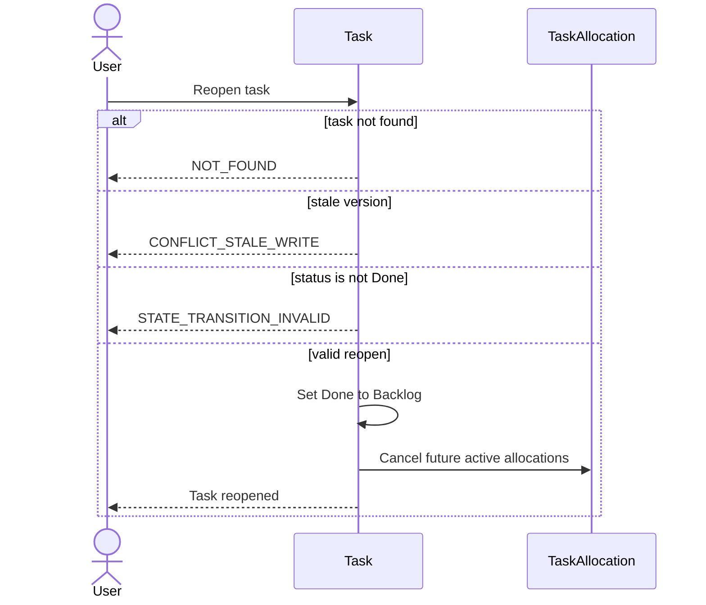
```mermaid
sequenceDiagram
    actor U as User
    participant T as Task
    participant A as TaskAllocation
    U->>T: Reopen task
    alt task not found
        T-->>U: NOT_FOUND
    else stale version
        T-->>U: CONFLICT_STALE_WRITE
    else status is not Done
        T-->>U: STATE_TRANSITION_INVALID
    else valid reopen
        T->>T: Set Done to Backlog
        T->>A: Cancel future active allocations
        T-->>U: Task reopened
    end
```

## TSK-07 Archive Task

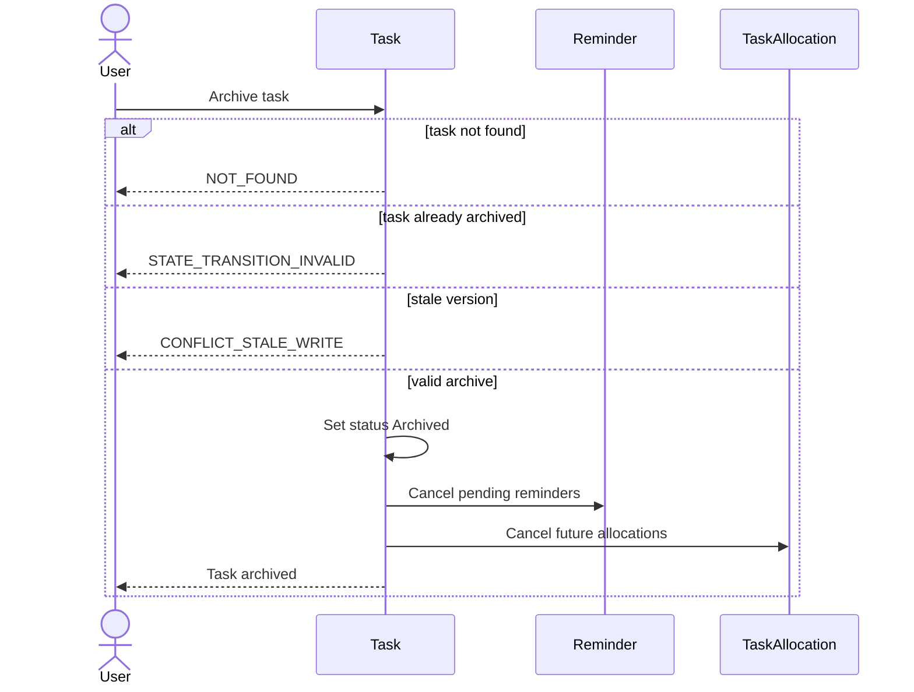
```mermaid
sequenceDiagram
    actor U as User
    participant T as Task
    participant R as Reminder
    participant A as TaskAllocation
    U->>T: Archive task
    alt task not found
        T-->>U: NOT_FOUND
    else task already archived
        T-->>U: STATE_TRANSITION_INVALID
    else stale version
        T-->>U: CONFLICT_STALE_WRITE
    else valid archive
        T->>T: Set status Archived
        T->>R: Cancel pending reminders
        T->>A: Cancel future allocations
        T-->>U: Task archived
    end
```

## TSK-08 Restore Task

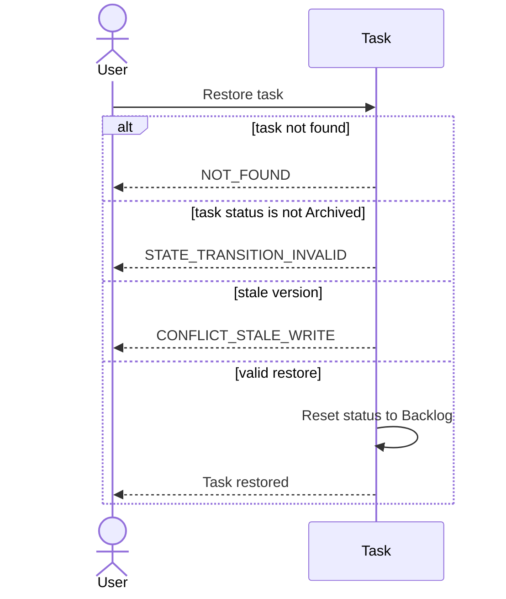
```mermaid
sequenceDiagram
    actor U as User
    participant T as Task
    U->>T: Restore task
    alt task not found
        T-->>U: NOT_FOUND
    else task status is not Archived
        T-->>U: STATE_TRANSITION_INVALID
    else stale version
        T-->>U: CONFLICT_STALE_WRITE
    else valid restore
        T->>T: Reset status to Backlog
        T-->>U: Task restored
    end
```

## TSK-09 Bulk Task Mutation

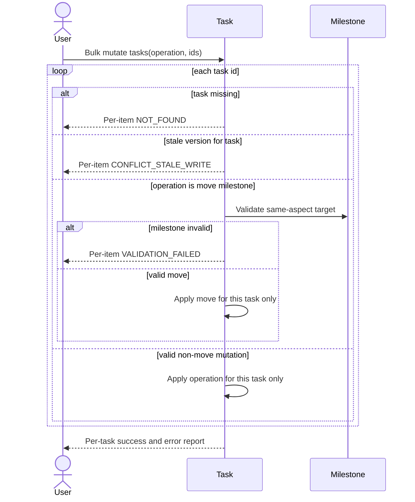
```mermaid
sequenceDiagram
    actor U as User
    participant T as Task
    participant M as Milestone
    U->>T: Bulk mutate tasks(operation, ids)
    loop each task id
        alt task missing
            T-->>U: Per-item NOT_FOUND
        else stale version for task
            T-->>U: Per-item CONFLICT_STALE_WRITE
        else operation is move milestone
            T->>M: Validate same-aspect target
            alt milestone invalid
                T-->>U: Per-item VALIDATION_FAILED
            else valid move
                T->>T: Apply move for this task only
            end
        else valid non-move mutation
            T->>T: Apply operation for this task only
        end
    end
    T-->>U: Per-task success and error report
```

## TSK-10 Query and Search Tasks

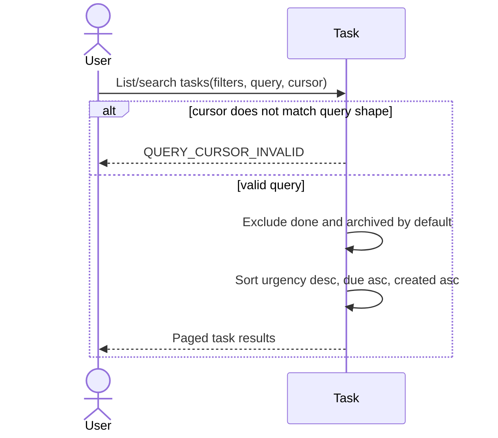
```mermaid
sequenceDiagram
    actor U as User
    participant T as Task
    U->>T: List/search tasks(filters, query, cursor)
    alt cursor does not match query shape
        T-->>U: QUERY_CURSOR_INVALID
    else valid query
        T->>T: Exclude done and archived by default
        T->>T: Sort urgency desc, due asc, created asc
        T-->>U: Paged task results
    end
```

## TSK-11 Read Task Detail

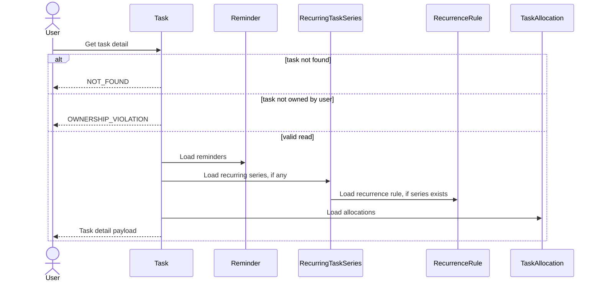
```mermaid
sequenceDiagram
    actor U as User
    participant T as Task
    participant R as Reminder
    participant S as RecurringTaskSeries
    participant C as RecurrenceRule
    participant A as TaskAllocation
    U->>T: Get task detail
    alt task not found
        T-->>U: NOT_FOUND
    else task not owned by user
        T-->>U: OWNERSHIP_VIOLATION
    else valid read
        T->>R: Load reminders
        T->>S: Load recurring series, if any
        S->>C: Load recurrence rule, if series exists
        T->>A: Load allocations
        T-->>U: Task detail payload
    end
```

## REC-01 Create or Update Series and Rule

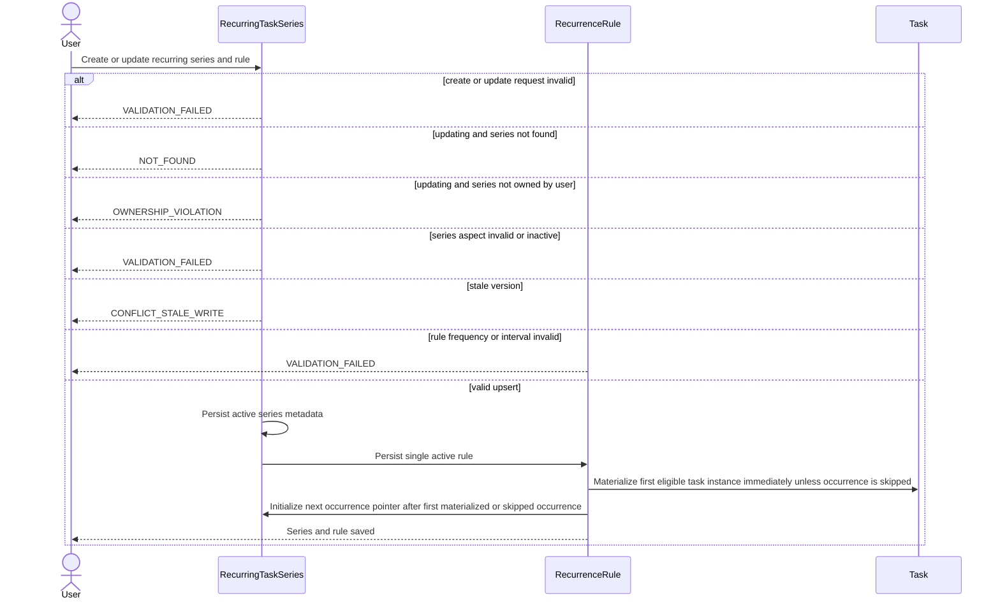
```mermaid
sequenceDiagram
    actor U as User
    participant S as RecurringTaskSeries
    participant C as RecurrenceRule
    participant T as Task
    U->>S: Create or update recurring series and rule
    alt create or update request invalid
        S-->>U: VALIDATION_FAILED
    else updating and series not found
        S-->>U: NOT_FOUND
    else updating and series not owned by user
        S-->>U: OWNERSHIP_VIOLATION
    else series aspect invalid or inactive
        S-->>U: VALIDATION_FAILED
    else stale version
        S-->>U: CONFLICT_STALE_WRITE
    else rule frequency or interval invalid
        C-->>U: VALIDATION_FAILED
    else valid upsert
        S->>S: Persist active series metadata
        S->>C: Persist single active rule
        C->>T: Materialize first eligible task instance immediately unless occurrence is skipped
        C->>S: Initialize next occurrence pointer after first materialized or skipped occurrence
        C-->>U: Series and rule saved
    end
```

## REC-02 Pause or Resume Rule

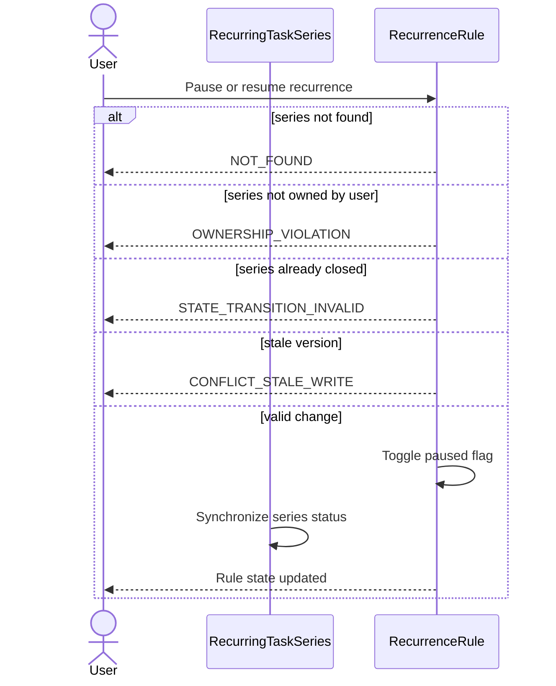
```mermaid
sequenceDiagram
    actor U as User
    participant S as RecurringTaskSeries
    participant C as RecurrenceRule
    U->>C: Pause or resume recurrence
    alt series not found
        C-->>U: NOT_FOUND
    else series not owned by user
        C-->>U: OWNERSHIP_VIOLATION
    else series already closed
        C-->>U: STATE_TRANSITION_INVALID
    else stale version
        C-->>U: CONFLICT_STALE_WRITE
    else valid change
        C->>C: Toggle paused flag
        S->>S: Synchronize series status
        C-->>U: Rule state updated
    end
```

## REC-03 Skip or Move Occurrence

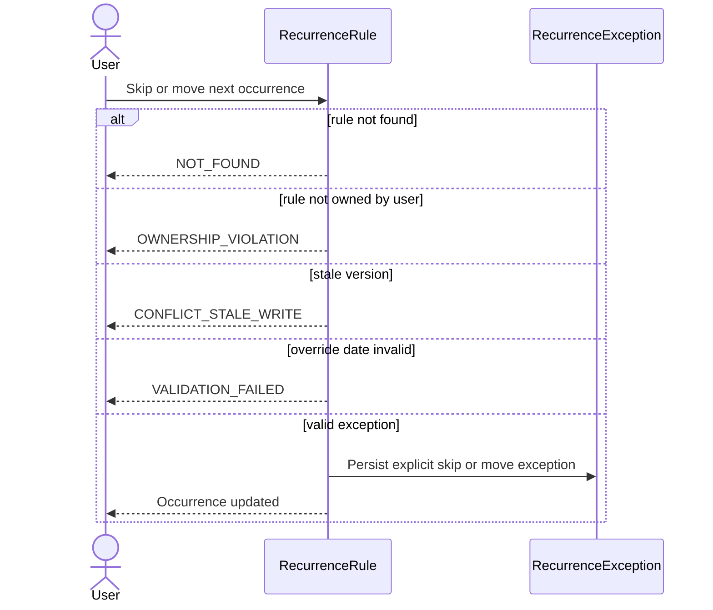
```mermaid
sequenceDiagram
    actor U as User
    participant C as RecurrenceRule
    participant E as RecurrenceException
    U->>C: Skip or move next occurrence
    alt rule not found
        C-->>U: NOT_FOUND
    else rule not owned by user
        C-->>U: OWNERSHIP_VIOLATION
    else stale version
        C-->>U: CONFLICT_STALE_WRITE
    else override date invalid
        C-->>U: VALIDATION_FAILED
    else valid exception
        C->>E: Persist explicit skip or move exception
        C-->>U: Occurrence updated
    end
```

## REC-04 Generate Next Instance

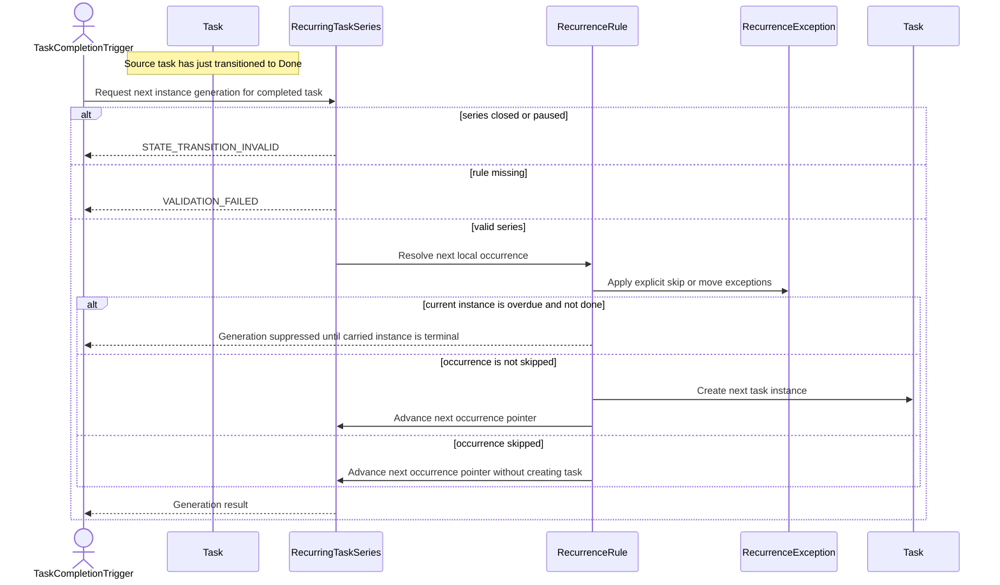
```mermaid
sequenceDiagram
    actor X as TaskCompletionTrigger
    participant T as Task
    participant S as RecurringTaskSeries
    participant C as RecurrenceRule
    participant E as RecurrenceException
    participant N as Task
    Note over T: Source task has just transitioned to Done
    X->>S: Request next instance generation for completed task
    alt series closed or paused
        S-->>X: STATE_TRANSITION_INVALID
    else rule missing
        S-->>X: VALIDATION_FAILED
    else valid series
        S->>C: Resolve next local occurrence
        C->>E: Apply explicit skip or move exceptions
        alt current instance is overdue and not done
            C-->>X: Generation suppressed until carried instance is terminal
        else occurrence is not skipped
            C->>N: Create next task instance
            C->>S: Advance next occurrence pointer
        else occurrence skipped
            C->>S: Advance next occurrence pointer without creating task
        end
        S-->>X: Generation result
    end
```

## REC-05 Close Series

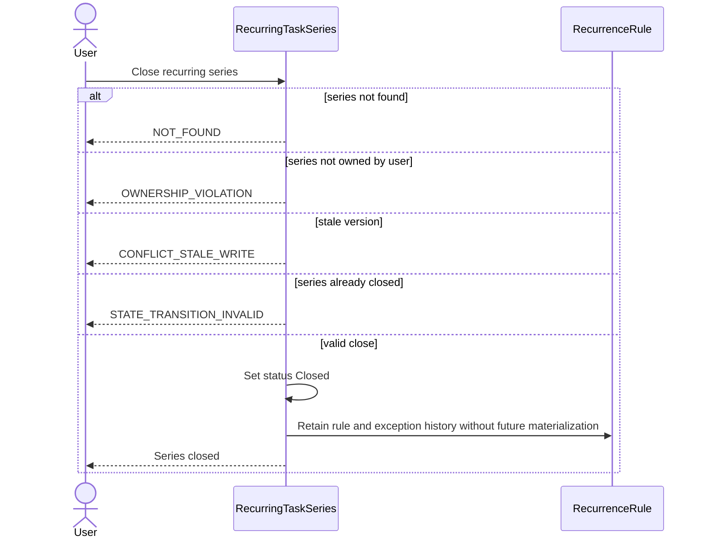
```mermaid
sequenceDiagram
    actor U as User
    participant S as RecurringTaskSeries
    participant C as RecurrenceRule
    U->>S: Close recurring series
    alt series not found
        S-->>U: NOT_FOUND
    else series not owned by user
        S-->>U: OWNERSHIP_VIOLATION
    else stale version
        S-->>U: CONFLICT_STALE_WRITE
    else series already closed
        S-->>U: STATE_TRANSITION_INVALID
    else valid close
        S->>S: Set status Closed
        S->>C: Retain rule and exception history without future materialization
        S-->>U: Series closed
    end
```
