# Availability and Planning Sequences

## AVL-01 Create One-Off Availability Block

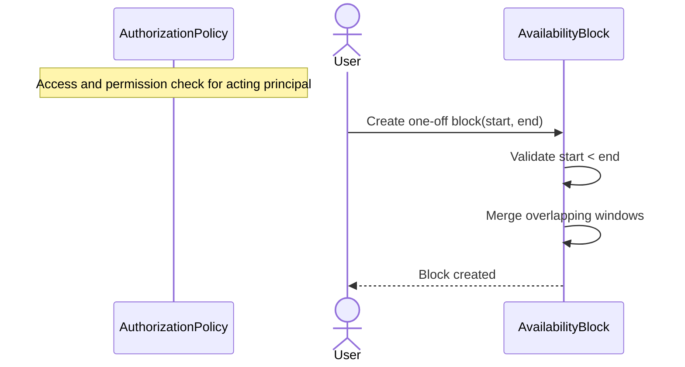

## AVL-02 Create Recurring Availability Block

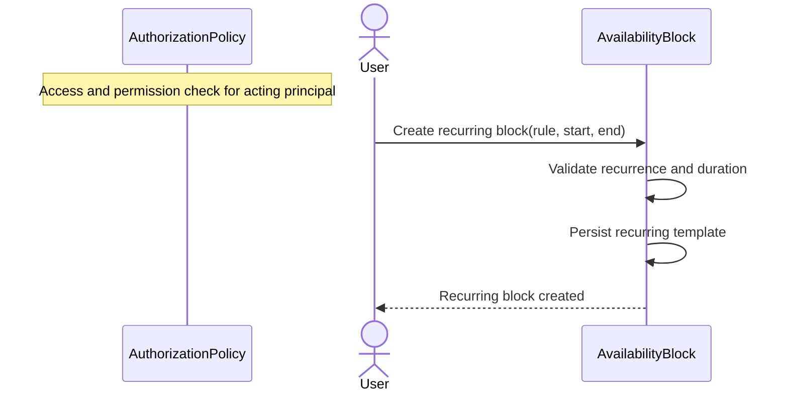

## AVL-03 Add Recurring Exception

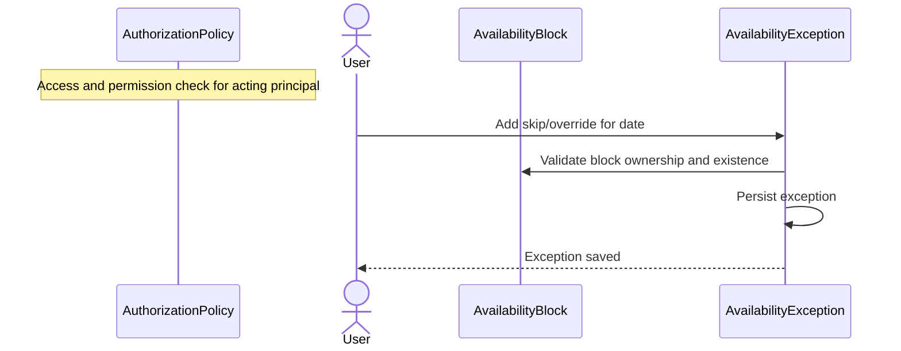

## AVL-04 Update, Archive, Restore Availability

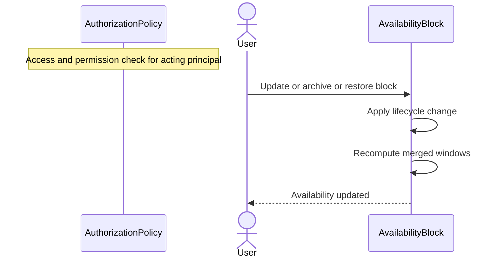

## AVL-05 Query Effective Availability

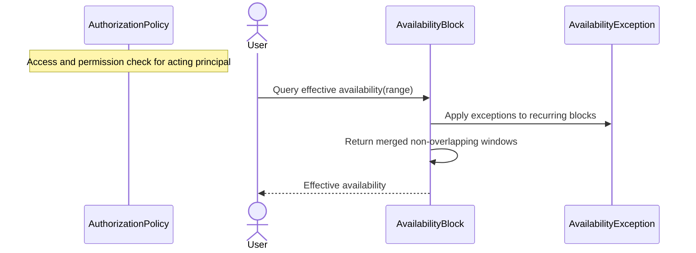

## PLN-01 Generate Draft Weekly Plan

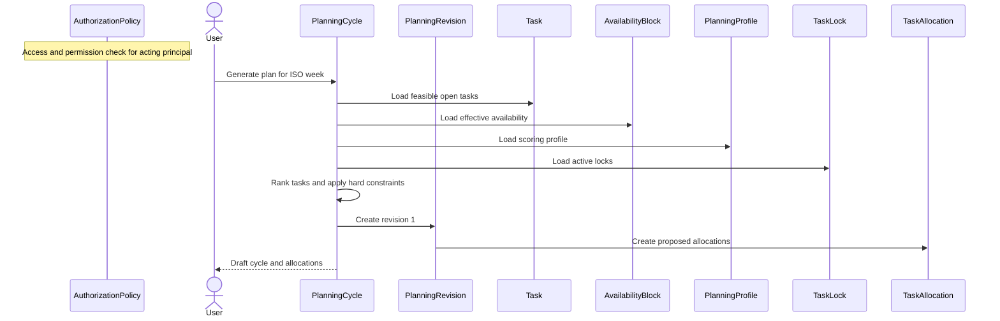

## PLN-02 Confirm Draft Plan

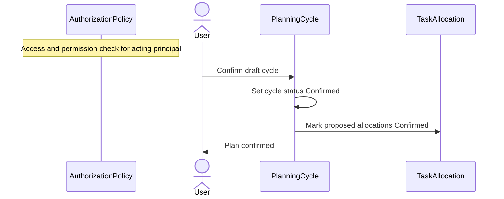

## PLN-03 Regenerate Confirmed Plan

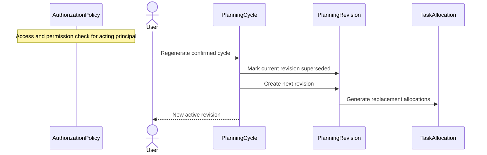

## PLN-04 Edit Allocation, Lock, Unlock, Cancel

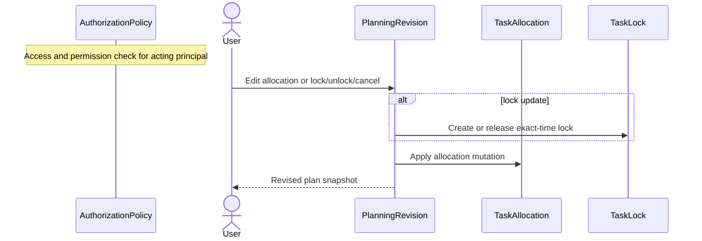

## PLN-05 Day-Boundary Replan Job

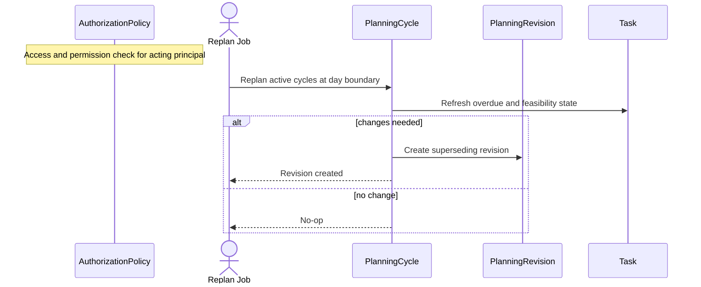

## PLN-06 Query Cycles and Revisions

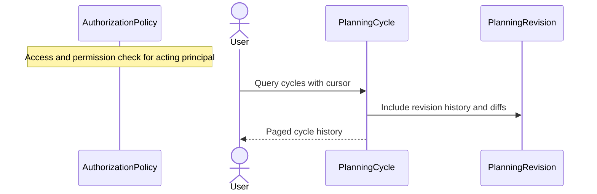
