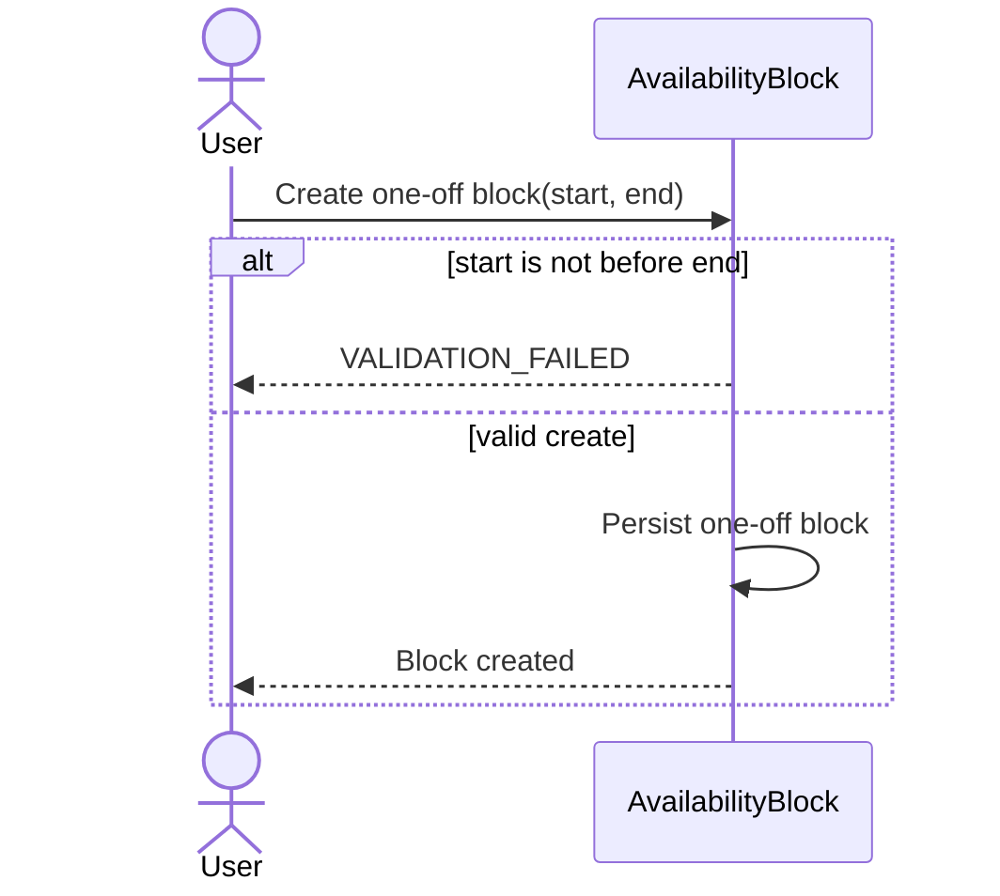
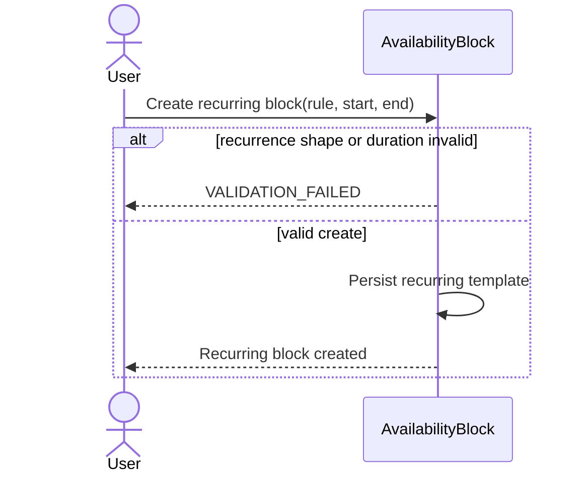
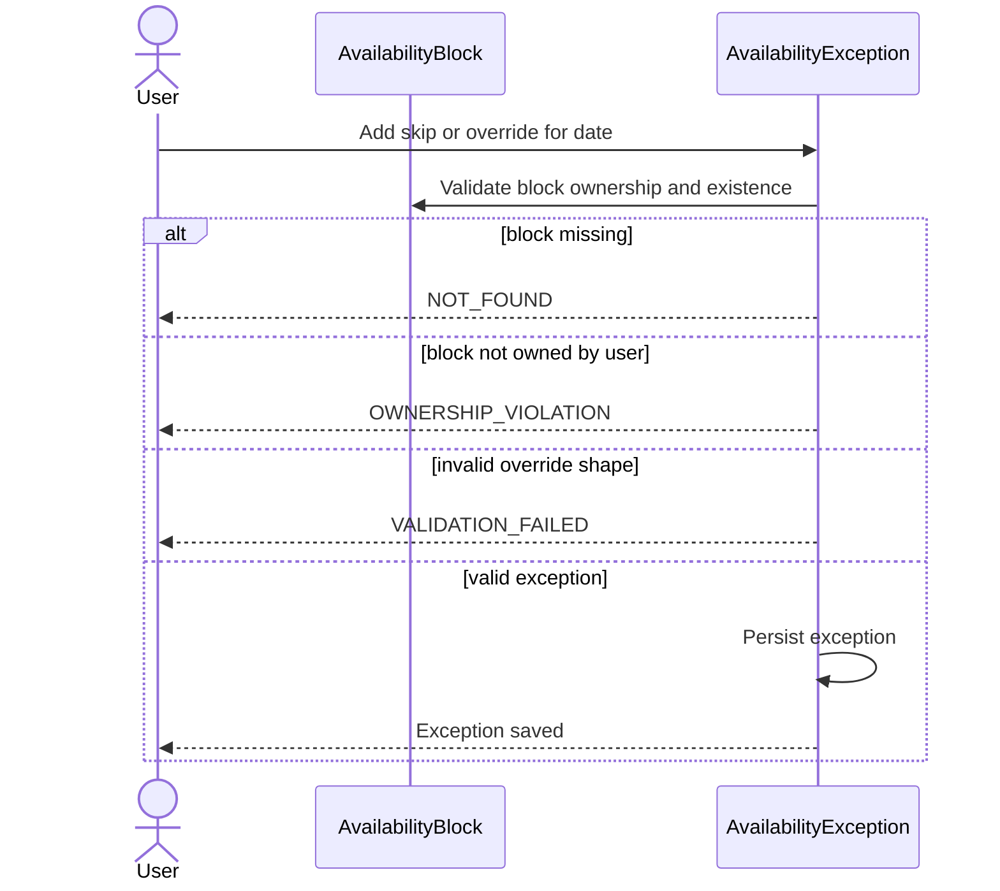
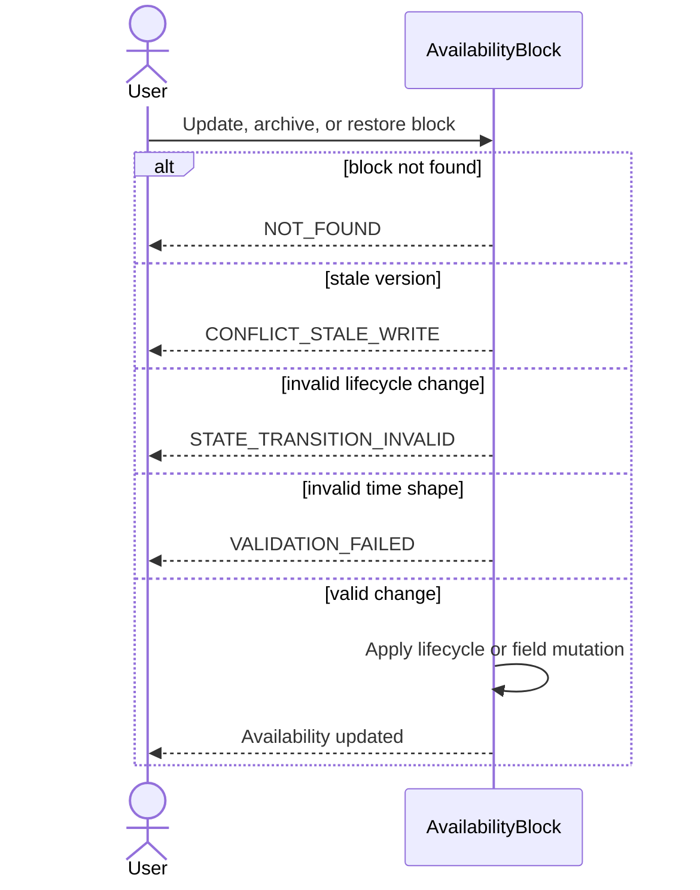
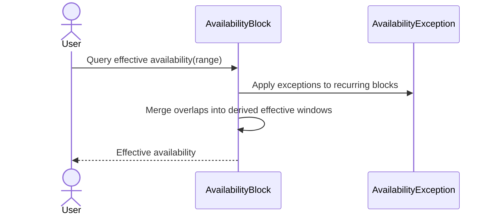
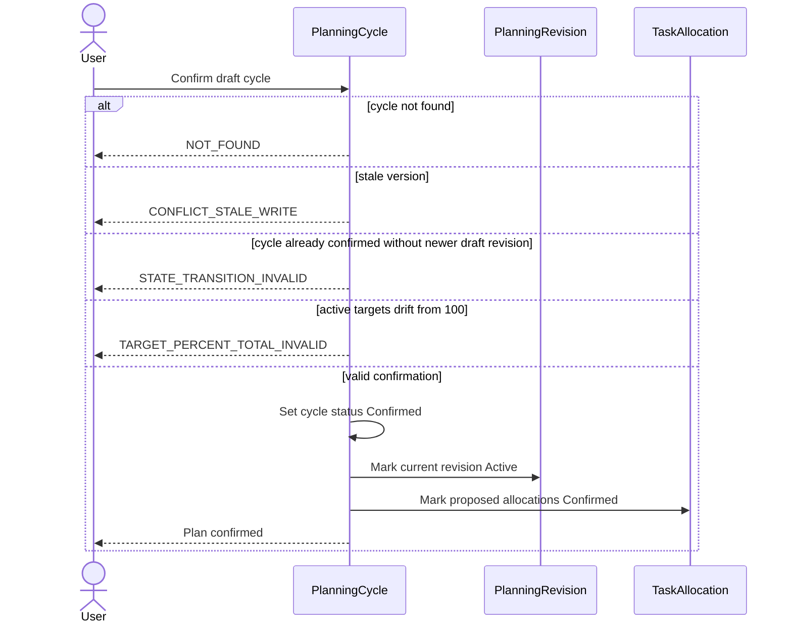
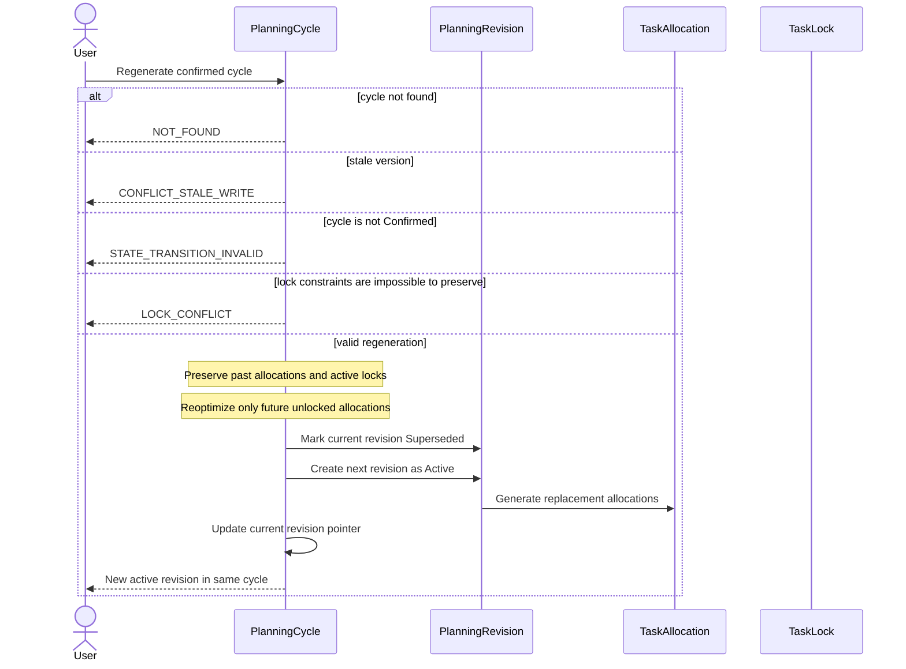
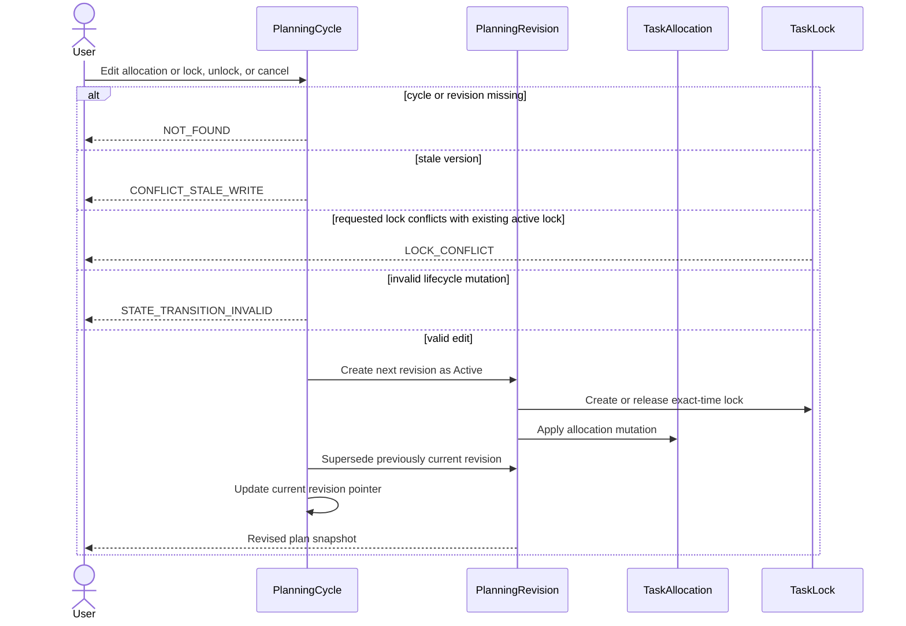
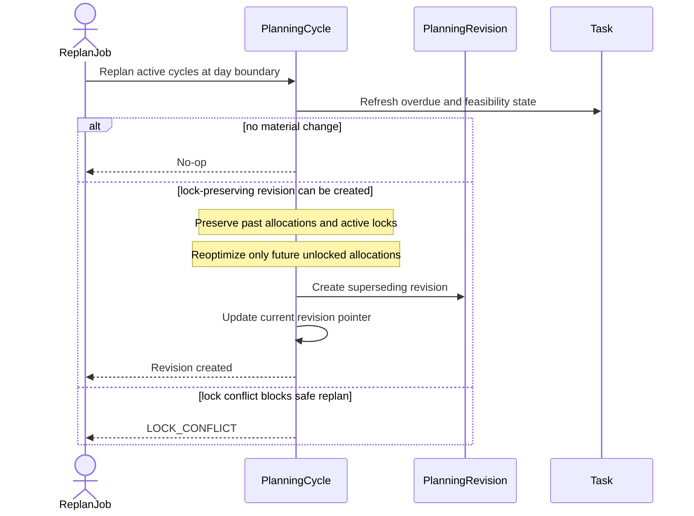
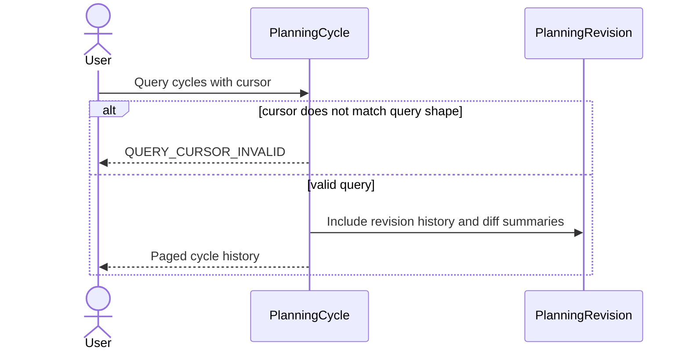

# Availability and Planning Sequences

All sequences assume principal validation before the first domain read or mutation.

<a id="AVL-01"></a>

## AVL-01 Create One-Off Availability Block



<a id="AVL-02"></a>

## AVL-02 Create Recurring Availability Block



<a id="AVL-03"></a>

## AVL-03 Add Recurring Exception



<a id="AVL-04"></a>

## AVL-04 Update, Archive, Restore Availability



<a id="AVL-05"></a>

## AVL-05 Query Effective Availability



<a id="PLN-01"></a>

## PLN-01 Generate Draft Weekly Plan

```mermaid
sequenceDiagram
    actor U as User
    participant C as PlanningCycle
    participant R as PlanningRevision
    participant T as Task
    participant B as AvailabilityBlock
    participant P as PlanningProfile
    participant L as TaskLock
    participant A as TaskAllocation
    U->>C: Generate plan for ISO week
    alt active aspect targets do not total 100
        C-->>U: TARGET_PERCENT_TOTAL_INVALID
    else valid target distribution
        C->>T: Load feasible open tasks
        C->>B: Load effective availability
        C->>P: Load scoring profile
        C->>L: Load active locks
        alt active lock makes a user-forced slot impossible
            C-->>U: LOCK_CONFLICT
        else feasible draft
            Note over C: Due feasibility means all remaining minutes must fit by the end of the task's due local date
            Note over C: Splittable tasks may use multiple windows respecting min chunk; non-splittable tasks must fit contiguously
            Note over C: v1 uses a deterministic heuristic scheduler, not an exact optimization solver
            C->>C: Rank feasible tasks by weighted score and greedily assign earliest valid windows under hard constraints
            Note over C: Lower-ranked feasible tasks may be deferred when capacity is insufficient
            C->>R: Create new active draft revision and supersede prior draft revision if present
            R->>A: Create proposed allocations for scheduled subset
            C-->>U: Draft cycle, revision, deferred set, and allocations
        end
    end
```

<a id="PLN-02"></a>

## PLN-02 Confirm Draft Plan



<a id="PLN-03"></a>

## PLN-03 Regenerate Confirmed Plan



<a id="PLN-04"></a>

## PLN-04 Edit Allocation, Lock, Unlock, Cancel



<a id="PLN-05"></a>

## PLN-05 Day-Boundary Replan Job



<a id="PLN-06"></a>

## PLN-06 Query Cycles and Revisions


