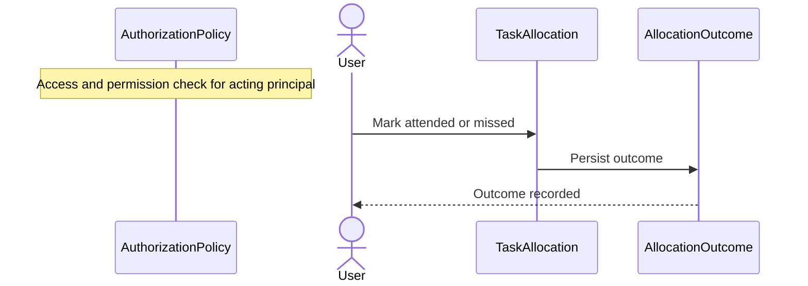
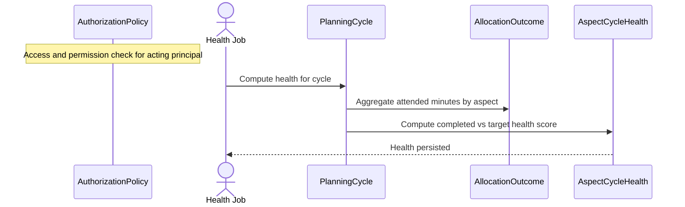
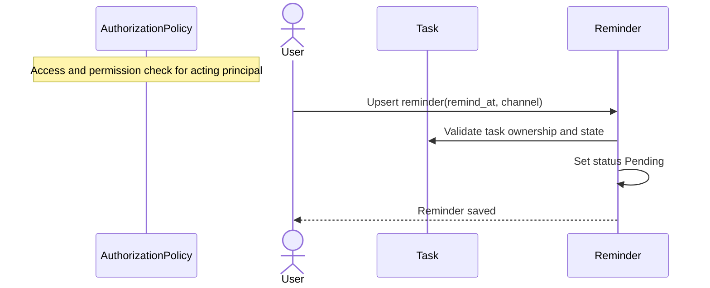
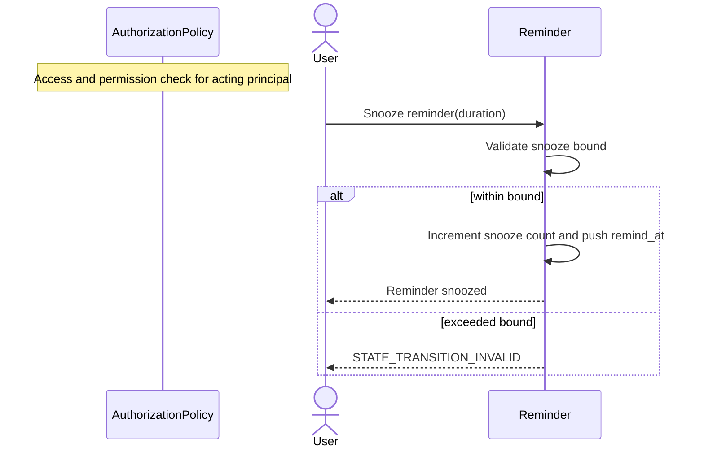
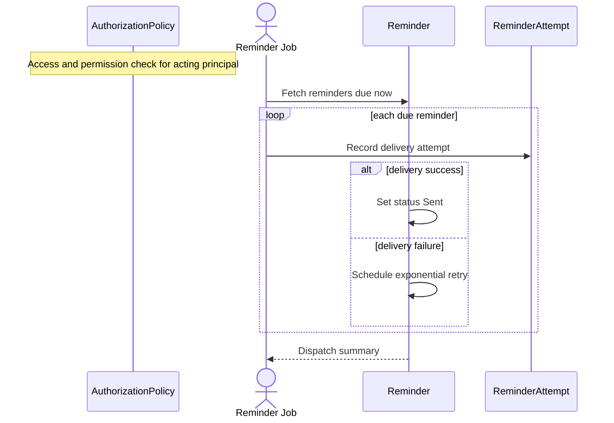
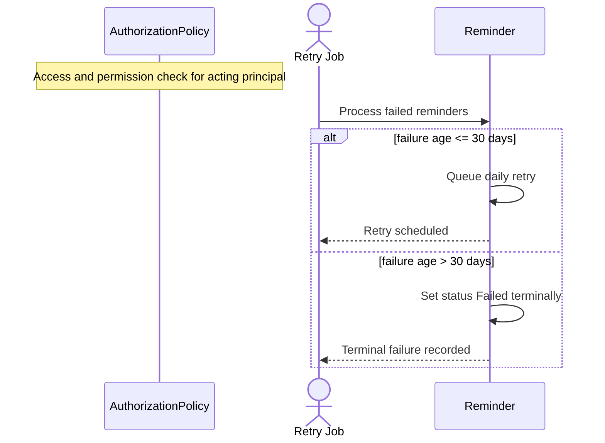

# Execution and Reminder Sequences

## EXE-01 Mark Allocation Outcome

## EXE-02 Compute Aspect Health

## REM-01 Create or Update Reminder

## REM-02 Snooze Reminder

## REM-03 Reminder Dispatch Job

## REM-04 Retry Exhaustion and Terminal Failure

