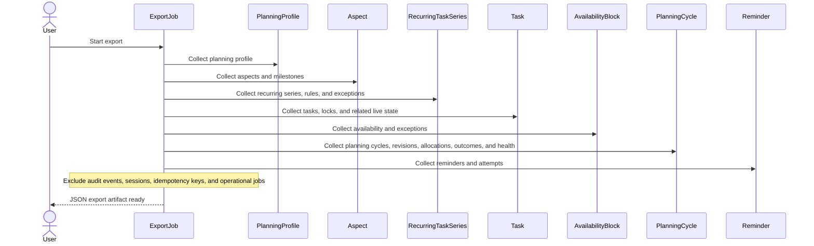
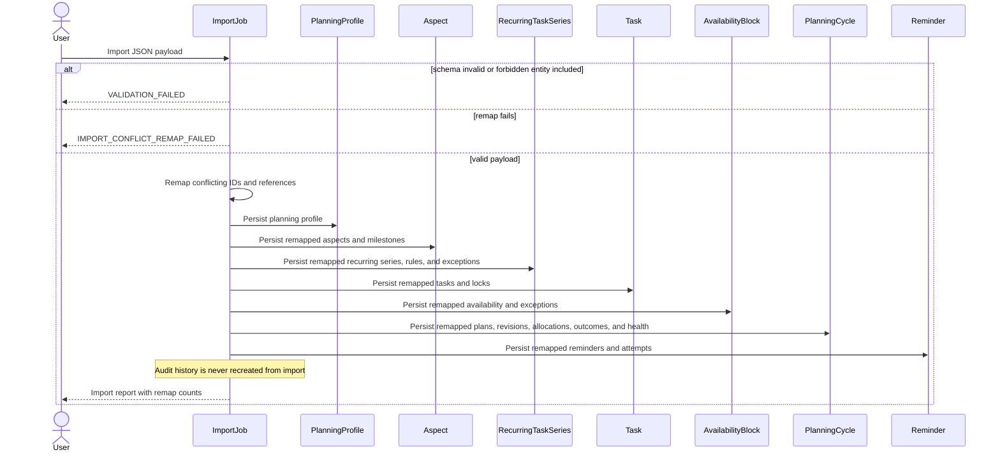
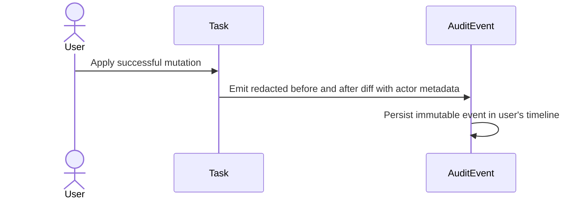
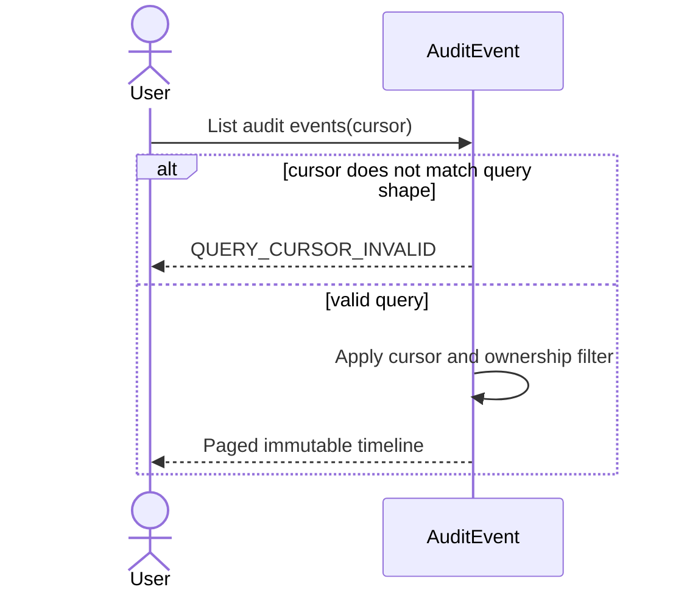
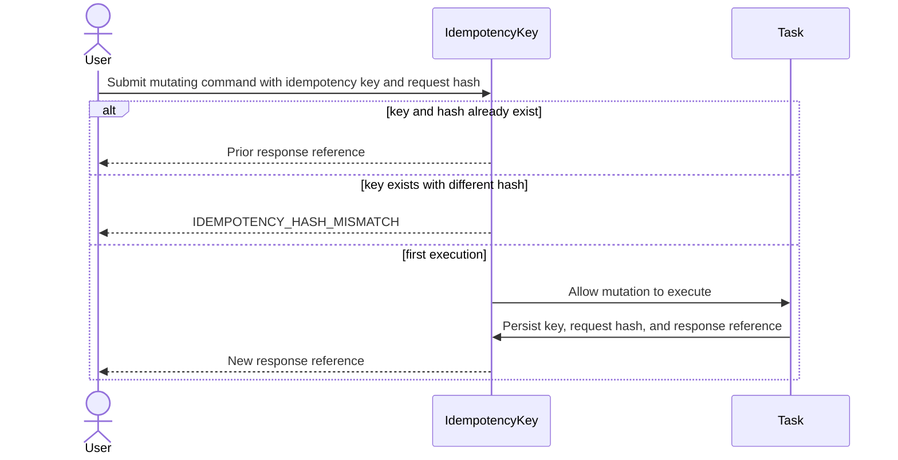
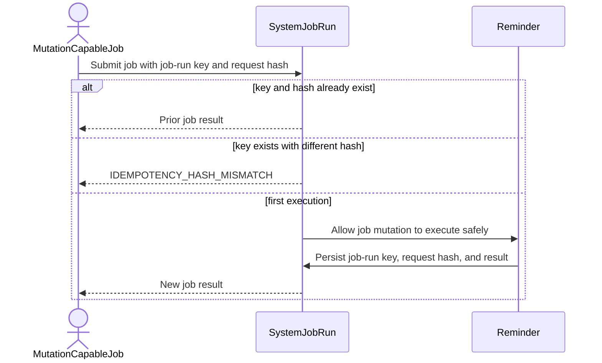

# Data, Audit, and System Sequences

All sequences assume principal validation before the first domain read or mutation.

## DAT-01 Export JSON

## DAT-02 Import JSON with ID Remap

## AUD-01 Emit Audit Event on Write

## AUD-02 Query Audit Timeline

## SYS-01 Idempotent Command Handling

## SYS-02 Idempotent Job Handling

